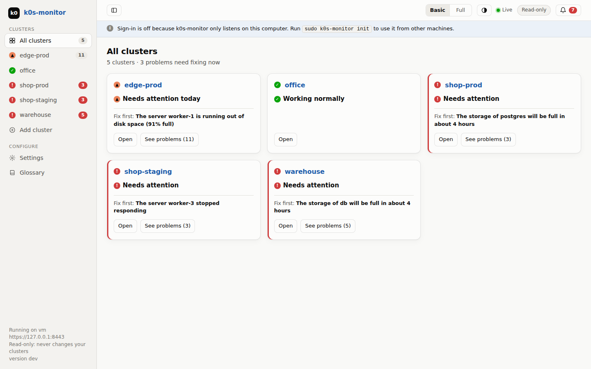
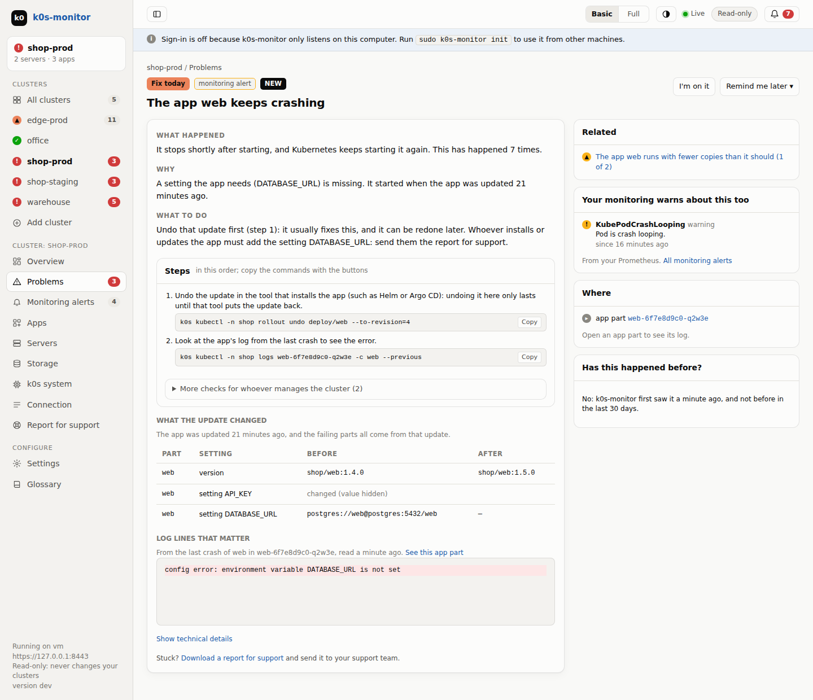
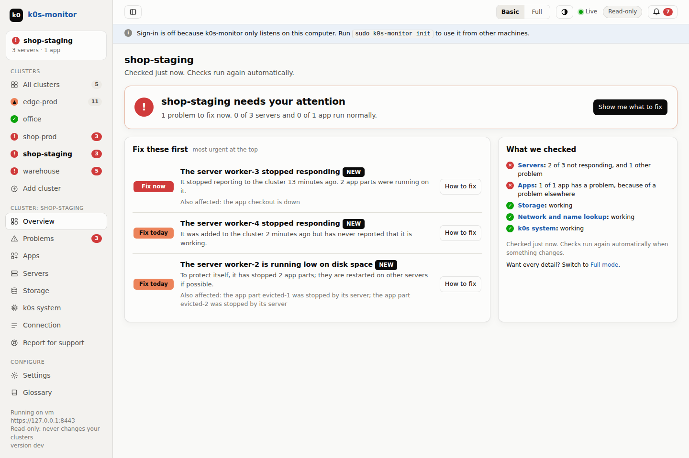
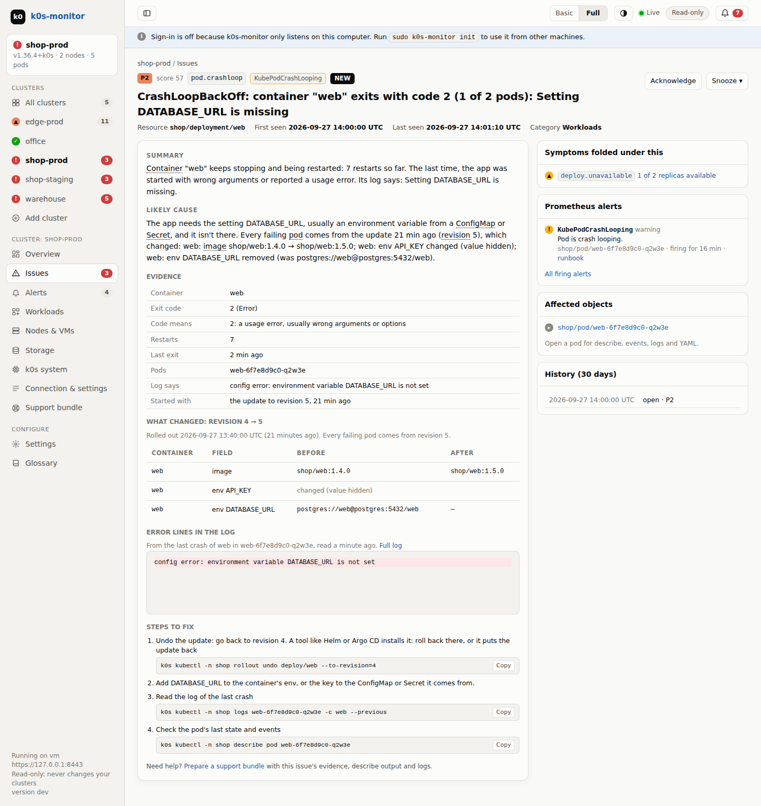
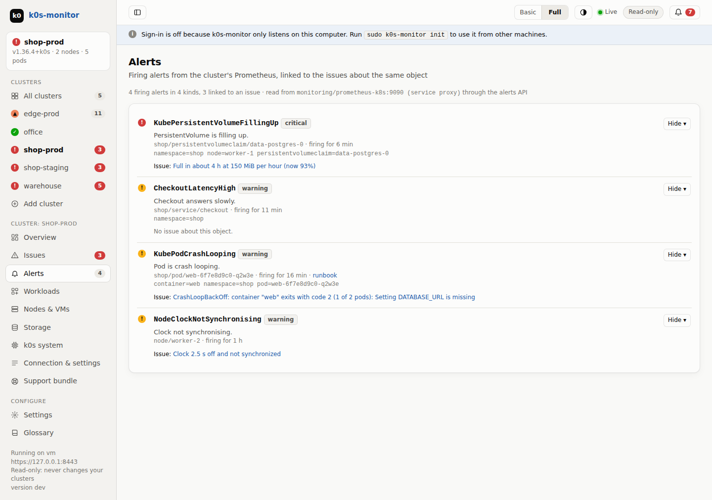
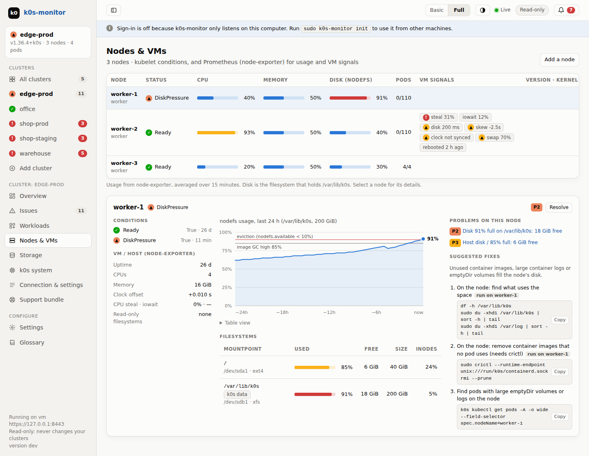
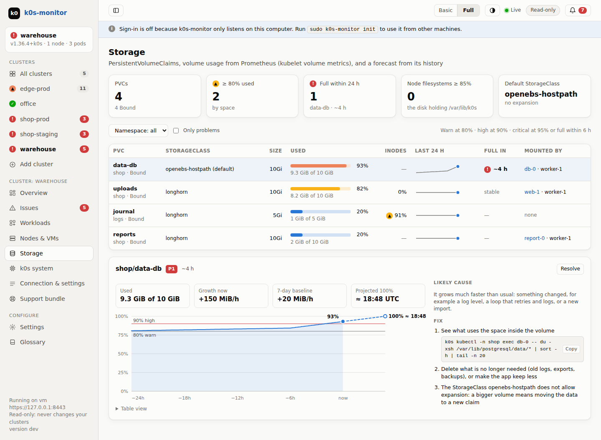
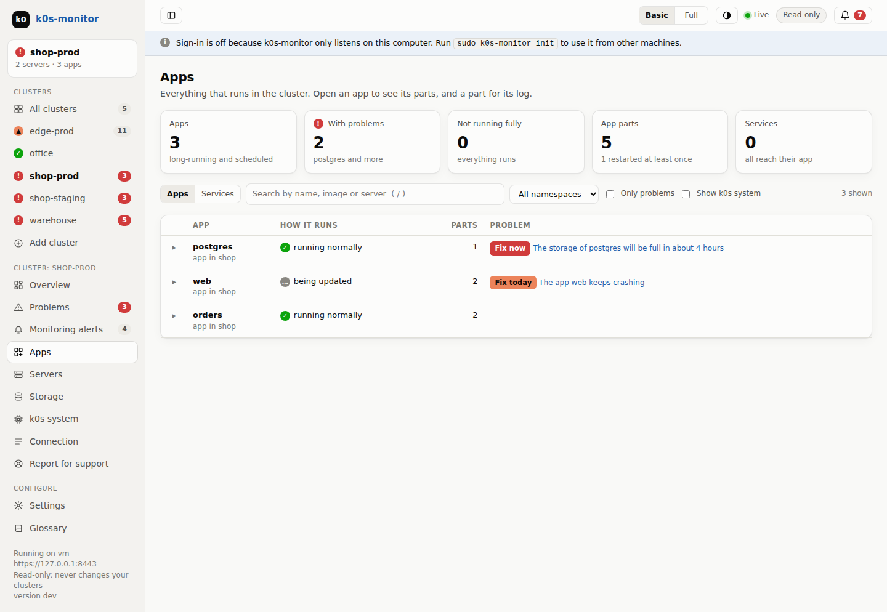
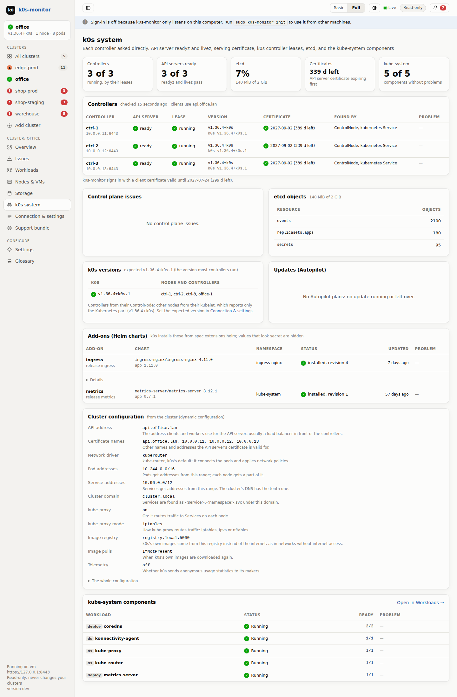
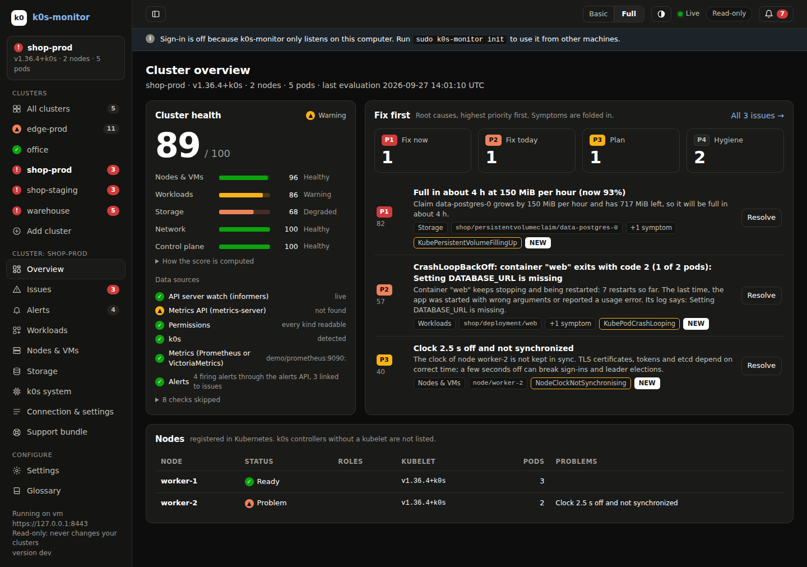

# k0s-monitor

k0s-monitor is a diagnostics and health-monitoring tool for [k0s](https://k0sproject.io) clusters. Its goal is to let people run products built on k0s with confidence, whether or not they know Kubernetes. It is a single binary that runs on a Linux jump host and is used from a browser, for example on Windows 10, over the LAN. It:

- connects to up to 5 local or remote clusters at once, added by uploading their kubeconfig, `k0sctl.yaml` or `k0s.yaml`, and detects problems across nodes and VMs, workloads, storage, networking and the k0s control plane,
- groups symptoms under their root cause and ranks the causes from P1 to P4,
- shows `kubectl describe` output, events and logs, and explains each problem with steps to fix it,
- watches health using your existing Prometheus: volumes that are almost full (with a forecast), node disk and memory pressure, VM signals and certificate expiry,
- is read-only: it never changes your clusters, it tells you exactly what to do, and it creates a report for your support team,
- shows notifications in the UI, and checks that every node runs the k0s version your product ships,
- has a **Basic / Full** switch: plain language for non-experts, full technical detail for k0s experts.

> **Status:** milestones M0 (foundations), M1 (web UI and the main rules), M2 (health from Prometheus or VictoriaMetrics) and M4 (the report for support, product packs, the add-node guide and packaging) are done. M3 (k0s itself) is built; its usability round is ready to run with participants: see [`test/usability/`](test/usability/). An expert walkthrough of its tasks has already been done, and what it found has been fixed. M5 (extras) is in, except the optional node agent: alerts from Prometheus linked to the problems, kernel errors (V04) from node-problem-detector and node-exporter, k0s's own service stopped (V05), and [Explain with AI](#explain-with-ai) with local or cloud models. See the [plan](docs/PLAN.md#17-milestones).

- 📄 **Plan:** [`docs/PLAN.md`](docs/PLAN.md)

| Basic mode: all clusters | Basic mode: a problem, explained |
|---|---|
|  |  |
| **Basic mode: a cluster's overview** | **Full mode: a problem with its evidence, what the update changed and the matching alert** |
|  |  |
| **Full mode: alerts from Prometheus, linked to the issues** | **Full mode: nodes and VM signals from Prometheus** |
|  |  |
| **Full mode: volumes and a fill forecast** | **Basic mode: every app and its problem** |
|  |  |
| **Full mode: the k0s system, each controller asked directly** | **Full mode, dark theme: a cluster's overview** |
|  |  |

## Install on the jump host

k0s-monitor is one static binary for Linux (amd64 or arm64). Download it from the project's GitHub releases (each has `SHA256SUMS`), or build it with Go 1.26 or newer (`make dist` builds both, with their checksums). Copy it to the jump host, check it, and run `init` once as root:

```sh
sha256sum -c --ignore-missing SHA256SUMS
sudo install -m 0755 k0s-monitor-linux-amd64 /usr/local/bin/k0s-monitor
sudo k0s-monitor init --allow-from 192.168.10.25   # your PC; asks for the password of the admin account
sudo systemctl enable --now k0s-monitor
```

`init` sets up everything the service needs, and can be run again safely:

- `/etc/k0s-monitor/config.yaml`, the configuration. The UI listens on port 8443 of every address by default; use `--listen` to change it. `--allow-from` (repeatable, or comma-separated addresses and CIDR ranges) writes `allowFrom`, which accepts only those clients; without it, anyone who can reach the port may open the sign-in page, and `init`, the service log and the Settings page say so.
- A local certificate authority and the UI's HTTPS certificate for this machine's names and addresses (`--san` adds more). The authority can only sign for these names and for private addresses.
- `secret.key`, which encrypts the cluster credentials you add in the UI. Back it up together with `/var/lib/k0s-monitor`.
- A `k0s-monitor` system user and a hardened systemd unit: no capabilities (except binding a port below 1024, if the UI uses one), a read-only system with only the data directory writable, and a limited set of system calls. The service only reads from your clusters. The unit can't run a binary from a home directory, so if `init` runs from one (for example `/root/k0s-monitor/bin/k0s-monitor`), it installs a copy as `/usr/local/bin/k0s-monitor` and uses that.

If the page doesn't open, `sudo systemctl status k0s-monitor` and `sudo journalctl -u k0s-monitor -n 50` say why.

**Updating:** replace the binary and run `sudo systemctl restart k0s-monitor`; the database upgrades itself. Back up `/var/lib/k0s-monitor` and `/etc/k0s-monitor` first: an older version refuses a database a newer one has upgraded.

Then, on your Windows 10 PC:

1. Copy `/etc/k0s-monitor/ca.crt` from the jump host, double-click it, choose **Install Certificate**, then **Local Machine**, then **Trusted Root Certification Authorities**. This is done once.
2. Open `https://<jump host>:8443` in Edge or Chrome and sign in.
3. Choose **Add cluster**, and drop your product's `cluster.config` (a kubeconfig) on the page, or paste it. You can add the matching `k0sctl.yaml` or `k0s.yaml` too.
4. If the file points at `localhost` (it only works on the controller itself), enter the address the jump host uses to reach the cluster. k0s-monitor tests the connection and explains any step that fails.
5. Keep **Create a read-only account** selected and choose **Save and connect**. k0s-monitor creates the service account `kube-system/k0s-monitor` with a read-only ClusterRole that can't read Secrets, and stores that account instead of your admin credentials. With **also read Secrets** ticked (the default), a second role lets it read Secrets: to warn before apps' certificates expire, and for the Secrets pages; see [Security](#security) for what that allows. The cluster's Connection page shows the commands to remove it again.

Up to 5 clusters can be added. The UI updates by itself as the clusters change.

### Container

The image (`ghcr.io/<owner>/k0s-monitor`, from the releases, or `make image`) runs the same binary as a non-root user, with the configuration and the data in two volumes. Set it up once, with the names the PCs use for the Docker host, then start it:

```sh
docker run --rm -it -v k0s-monitor-etc:/etc/k0s-monitor -v k0s-monitor-data:/var/lib/k0s-monitor \
  ghcr.io/<owner>/k0s-monitor init --san jump-01 --san 192.168.10.5 --allow-from 192.168.10.25
docker run -d --name k0s-monitor --restart unless-stopped -p 8443:8443 \
  -v k0s-monitor-etc:/etc/k0s-monitor -v k0s-monitor-data:/var/lib/k0s-monitor ghcr.io/<owner>/k0s-monitor
docker cp k0s-monitor:/etc/k0s-monitor/ca.crt ca.crt   # for your PC, as below
```

In the container, `init` creates no system user and no systemd unit. `docker exec k0s-monitor k0s-monitor passwd --user NAME` sets passwords; product packs go in the `packs` directory of the configuration volume. `allowFrom` sees your PC's address with Docker's default port publishing. To update, pull the new image and start a new container with the same volumes.

### Metrics

k0s-monitor reads metrics from Prometheus or VictoriaMetrics; both answer the same query API. It finds one running in the cluster by itself (for example `prometheus-k8s`, `prometheus-server`, `vmsingle-…` or `vmselect-…`) and reads it through the API server, so only port 6443 is needed. The read-only account gets access to that one Service; if it can't, the cluster's Connection page shows the `k0s kubectl` commands that grant it.

When the metrics run elsewhere, for example VictoriaMetrics on a controller host outside Kubernetes, enter the address on the cluster's Connection page under **Metrics source**: for example `http://10.0.0.5:8428` (VictoriaMetrics' default port) or whichever port yours listens on, and for a VictoriaMetrics cluster the vmselect path (`http://vmselect:8481/select/0/prometheus`). k0s-monitor then connects to it directly, so the jump host must reach that port. **Test** reads it once and says what it holds: node-exporter data for how many nodes, volume usage and container metrics. For clusters in the configuration file, set `prometheus.url` or `prometheus.service` instead. Node-exporter data is recognized whatever its scrape job is called.

Without Prometheus, or for nodes it doesn't cover, CPU and memory come from the metrics API (metrics-server, which k0s installs). Volume and node disk usage can come from the kubelets, sampled every 5 minutes, so forecasts start about an hour later. Reading the kubelets needs `get nodes/proxy`, which reaches the whole kubelet API, so the read-only account doesn't have it: the Connection page shows the commands that grant it, in a separate ClusterRole.

**Users:** `init` creates the account `admin`. Add more people in **Settings → Users**: each gets their own name and password. Everyone can do everything, including managing users; the audit log shows who did what, and "I'm on it" shows who is on it. Each person changes their own password in Settings; another user can set a forgotten one, which signs that person out everywhere. On the jump host, `sudo k0s-monitor passwd --user NAME` sets anyone's password, or adds the user if the name is new (without `--user`, it is admin's). Several people can be signed in at the same time, and each browser has its own session and its own unread notifications. An existing installation keeps its password as the admin account. To renew the certificate, for example after adding a name: `sudo k0s-monitor init --san jumphost.example.com --renew-cert`.

## Using the web UI

- **All clusters** shows each cluster's state and the problem to fix first.
- **Overview** says in one sentence whether the cluster needs attention, lists what to fix first, and what was checked: servers, apps, storage, network and the k0s system.
- **Problems** lists every problem, most urgent first. Symptoms appear under their root cause; fixing the cause fixes them too. Missing good practices (no memory limits, no health checks, `latest` images, and so on) are suggestions, not problems: Full mode lists them under Hygiene, and they don't count in the problem numbers, the health score or notifications. Basic mode leaves them out and says how many there are.
- A **problem's page** explains what happened, why, and what to do, with the commands to run in order and buttons to copy them. Commands use `k0s kubectl`, the kubectl that ships with k0s; with a separate kubectl, leave out `k0s `. It shows the log lines that matter for crashes, what a recent update changed, and when the problem happened before (see [Explaining crashes](#explaining-crashes)).
- **Apps** (Workloads in Full mode) lists everything that runs: Deployments, StatefulSets, DaemonSets, CronJobs, Jobs and pods without an owner, with how each runs, its restarts, nodes and problems. Open an app to see its pods, each with a link to its logs. Type to search by name, namespace, image, node or status; `/` jumps to the search from any page. Basic mode leaves out k0s's own parts in kube-system unless you ask for them. The **Services** tab lists every Service with its ports, ready endpoints, the apps it selects and the pods behind it.
- **Secrets** (a tab of Workloads in Full mode, when k0s-monitor may read the cluster's Secrets) lists the Secrets of a namespace with their type, number of keys and the apps that use them. A Secret's page shows its keys and their sizes, which apps use each key and how (environment variable, file, image pull), keys an app needs that are missing, and the certificate of a TLS Secret. Values stay hidden: see [Secret values](#secret-values).
- A **pod's page** shows its `kubectl describe` output, events, logs (with the previous run, filtering and live follow) and YAML, what each container's last exit code means, the known errors in the log of its last crash, and the Secrets it uses. Secret-looking values are masked.
- **Nodes & VMs** (Servers in Basic mode) shows each node's status, CPU, memory, the disk holding `/var/lib/k0s`, pods and VM signals (CPU steal, iowait, slow disks, clock, swap, reboots), with 24 hours of disk usage for the selected node. A node that stopped responding gets a checklist to copy and send. **Add a server** (Add a node) gives the commands to join a worker with the k0s version the product ships: the join token is created on a controller and the k0s program copied from it (or installed from get.k0s.sh), with the ports to open and, in Full mode, how to add a controller. k0s-monitor never creates join tokens itself. A product pack can replace the guide with the product's own procedure.
- **k0s system** shows each controller as it answered when asked directly (its API server's health checks, version, and certificate with its end date), whether k0s counts it as running by its lease, the etcd database's size and what fills it, and k0s's own parts in kube-system. k0s-monitor finds the controllers from k0s's ControlNode objects, the `kubernetes` Service and the kubeconfig; when it can't reach one from the jump host, it says so and still knows from the lease whether it runs.
  It also shows the k0s version of every node and controller against the one the cluster should run, and k0s's updates through Autopilot, node by node. The expected version comes from the cluster's `k0sVersion` setting (the configuration file, or Connection & settings for a cluster added in the UI), from an uploaded `k0sctl.yaml`, or else is the version most controllers run. k0s-monitor never changes the version: the fix is always a product update.
  **Add-ons** lists the Helm charts k0s installs (its Chart objects, from `spec.extensions.helm`): installed version and revision, or why it failed, with the repository and the chart's values; values under names that look secret (password, token, key…), private keys and passwords in URLs are hidden. **Cluster configuration** (Full mode) explains k0s's settings (network driver and address ranges, kube-proxy, node-local load balancing, image registry, add-ons, telemetry) and each worker profile's kubelet settings (log rotation, eviction thresholds, pod limit), with the whole configuration below. It comes from k0s's ClusterConfig object, which k0s publishes only with dynamic configuration (`--enable-dynamic-config`); otherwise from the `k0s.yaml` or `k0sctl.yaml` uploaded with the cluster. With both, it lists where the cluster differs from the uploaded file.
- **Failover:** when the kubeconfig's server stops answering, k0s-monitor goes on through another controller it has reached before, and goes back once that server answers again for a minute; the pages say which controller is in use. It remembers the controllers across restarts. Another controller gets the credentials only when its certificate is signed by the cluster's CA for `kubernetes.default.svc`, which every k0s API server has, and never when the kubeconfig skips certificate checks.
- **Storage** shows every volume claim: how full it is, its last 24 hours, when it will be full at its current growth, and who uses it.
- **Alerts** (Monitoring alerts in Basic mode) lists the alerts that fire in the cluster's Prometheus, most severe first, each with the problem k0s-monitor found about the same object: a pod and its app, an app, a volume claim, a node (by its `node` label or its node-exporter address) or a controller. A problem's page shows its alerts, with their runbook links in Full mode, and the problem lists tag them. Alerts come from Prometheus's alerts API, or else from the `ALERTS` series, which VictoriaMetrics has when vmalert writes it; the alerts API works with VictoriaMetrics when it runs with `-vmalert.proxyURL`. Heartbeat alerts such as Watchdog are left out. Alerts of one name are grouped ("HighIOUtilization ×12, on 4 servers"), each told apart by the labels that differ, such as its disk. An alert from node-exporter is about the server it describes, not node-exporter's own pod, and an alert about a server joins only that server's problems on the same topic (disk, memory, CPU, clock, network, or the server being down). **Hide** takes an alert out of k0s-monitor's lists and counts, everywhere in the cluster or on one server, for a day, a week, while it fires, or until shown again; the Hidden list shows who hid what, with **Show again**, and the audit log records it. Hiding never touches Prometheus or its Alertmanager: k0s-monitor never changes or silences an alert there. The API offers them as `GET /api/v1/clusters/{cluster}/alerts` (with what is hidden), hides and shows them with `POST …/alerts/hide` (`{"name", "server", "for": "1d" | "1w" | "firing" | "always"}`) and `POST …/alerts/show`, and the report for support has them in `alerts.json`.
- **Glossary:** words with a dotted underline explain themselves when you point at them, tab to them or tap them, and the Glossary page lists them all.
- **Basic / Full** switches between plain language and full technical detail: severity scores, rule IDs, evidence and raw messages. Each browser remembers its choice; the default for new browsers is `ui.defaultMode` in the configuration (Basic unless changed).
- **Light or dark:** the ◐ button at the top switches between light and dark colors, or follows the computer's setting (the default). The button at the top left hides the menu on the left, for more room. Each browser remembers both.
- **I'm on it** (acknowledge) and **Remind me later** (snooze) take a problem out of the "fix first" list until it gets worse or the time is up, and show who did it. The bell shows new problems of the priorities listed in `ui.notify` (fix now and fix today by default).
- **Report for support** (Support bundle in Full mode, in the menu and on the Problems, problem and pod pages) makes a zip file to send to whoever helps you. It holds `index.html`, a summary of the open problems with their evidence, likely cause and steps; the problems and the cluster's state as JSON; the nodes, warning events and the k0s control plane; `kubectl describe` output of the affected objects; and the last 200 log lines of their containers, also from before their last restart. You look through every file before you download it; the prepared report stays for 30 minutes, for the user who made it only. **No Secret values are in it**: none are read for it, and values of secret-looking names, tokens, keys, private keys and passwords in URLs are replaced by `••••••` in describe output, logs and events. IP addresses can be replaced too (ip-1, ip-2, …, the same in every file). Making and downloading a report is recorded in the audit log. The API offers it as `GET /api/v1/clusters/{cluster}/report` (a zip file; `?preview=true` lists its files instead, `maskIPs=true`, `logs=false` and `suggestions=true` choose what goes in).

Everything a user does is kept in the audit log in Settings, with their name.

**Laptop mode:** `k0s-monitor serve --kubeconfig cluster.config` watches one cluster without installing anything. It listens on `127.0.0.1:8443` only, without sign-in, with a certificate made up on the spot.

## Product packs

A product pack is a YAML file in which your team describes a product to k0s-monitor, without code. Start from [`internal/pack/example.yaml`](internal/pack/example.yaml), also offered for download under Settings → Product packs, which explains every part. A pack can:

- **add checks**, each a rule named `pack.<pack>.<id>` with your own texts in both modes: at least N ready replicas of an app (`replicas`), a volume claim at most N% full (`volume`), an object that must exist, such as the backup CronJob (`exists`), at least N ready nodes (`nodes`), the image tag apps must run, such as `2.3.*` (`image`), and any PromQL query with a limit (`query`, read from the cluster's Prometheus);
- **name apps**: Basic mode says "Payments service" instead of `payments-api`, and the Apps page and problem pages link to the app's documentation;
- **add guides** to built-in problems, for some apps or all: what to do (Basic mode), the likely cause (Full mode), steps that come before the built-in ones, and links to runbooks;
- **explain the product's words** in the glossary and on every page;
- **set the k0s version** the product ships (a version set for the cluster wins over it; it wins over an uploaded `k0sctl.yaml`), and **who to contact for support**, which the problem pages and the report for support name.

A pack applies to every cluster, or to those its `clusters` patterns name. Put packs in `/etc/k0s-monitor/packs` (`packsDir` in the configuration; `init` creates it) and run `sudo systemctl reload k0s-monitor`, or upload them in **Settings → Product packs**, which lists every pack, what it adds and which files can't be used, and why. Uploading and removing packs is recorded in the audit log. `scan --packs DIR` uses them too. The API offers `GET /api/v1/packs`, `POST /api/v1/packs` (the file as the body) and `DELETE /api/v1/packs/{name}`.

## Explain with AI

A problem's page can ask a language model to explain the problem and how to fix it, in Basic mode's plain words or Full mode's technical ones. It is off until someone turns it on in **Settings → Explain with AI**.

It works with any API that follows OpenAI's chat completions: a model on a machine of yours, so that nothing leaves your network, or a provider's. The settings offer:

| Kind | Providers (preset address) |
|---|---|
| On your machines | Ollama (`http://127.0.0.1:11434/v1`), LM Studio (`:1234/v1`), llama.cpp server (`:8080/v1`), vLLM (`:8000/v1`), running Llama, Qwen, Mistral, gpt-oss and other open models |
| Cloud | OpenAI (ChatGPT), Anthropic (Claude, through its OpenAI-compatible API), DeepSeek, Qwen (Alibaba Cloud Model Studio), Google Gemini, Mistral, OpenRouter |
| Anything else | another OpenAI-compatible address |

Enter the address (up to `/v1`; a model on another machine needs that machine's address), the API key if the provider needs one, and the model's name; **Test** lists the models the API offers and asks the model for a word. Also: the language of the answers, the longest answer, a time limit (local models on a CPU can take minutes), whether to hide IP addresses (on by default) and whether to include log lines. The API key is stored encrypted with `secret.key`, like the clusters' credentials, and never shown again. It is sent only to the address it was entered for: a different address needs the key again, and saving one removes the old key, so nobody can send it elsewhere. The jump host connects to the API itself, through `HTTPS_PROXY` when set.

**What is sent**, for one problem when someone clicks **Explain**: its title, description and evidence, what an update changed, the steps k0s-monitor suggests, the problems it causes, its Prometheus alerts, the newest warning events about its objects and the log lines of the last crash, and the cluster's versions. Values of secret-looking names, tokens, keys and passwords in URLs are replaced first, as in the report for support; no Secret value is ever in it. **What is sent** on the page shows exactly that before you send it. Each request is recorded in the audit log with who asked, the problem, the provider and the model; if the audit log can't be written, nothing is sent. The answer streams in as it is written, a model's thinking is left out, and the answer stays on the page for a day (until the settings change) for everyone. Answers can be wrong: they say so.

The API offers `GET` and `PUT /api/v1/settings/ai`, `POST /api/v1/settings/ai/test`, `GET /api/v1/clusters/{cluster}/findings/{id}/explain` (what would be sent, and the last answer) and `POST` to the same address (the answer, as server-sent events).

## Security

- **Who can reach it.** Set `allowFrom` to your PCs (`init --allow-from`), and allow port 8443 in the firewall from those only. Refused addresses get no page at all, not even the sign-in.
- **Sign-in.** Passwords are hashed with Argon2id. After 5 wrong ones from an address within 15 minutes, that address waits, longer each time; at most 4 passwords are checked at once, so a flood of sign-ins can't exhaust the memory. Sessions end after `auth.sessionIdle` without activity (12 h) and `auth.sessionMax` after sign-in (24 h).
- **Cluster credentials.** Use k0s-monitor's read-only account for every cluster. It can read pod logs and settings, which sometimes hold passwords: treat what k0s-monitor shows as confidential. Credentials are stored encrypted with `secret.key`, which is on the same machine, so it protects copies and backups of the database, not a taken-over machine. A cluster added with its uploaded credentials shows a warning on its Connection page, with a button that switches it to the read-only account and deletes them. If the jump host is compromised, remove the account from each cluster with the commands on that page.
- **Secrets.** To warn before apps' certificates expire, and for the Secrets pages, the read-only account gets a second, optional role, `k0s-monitor:secrets`, when you add a cluster (a checkbox, on by default) or with the commands on the cluster's Connection page. Kubernetes can't limit it to TLS Secrets: with it, the account's token can read **every Secret in the cluster**, passwords and keys included, so whoever takes over the jump host and its `secret.key` can too. k0s-monitor itself watches only Secrets of type `kubernetes.io/tls`, keeps only their certificate (names, issuer and dates), and drops the private key and every annotation as each one arrives; the permission is checked with an access review, which reads no Secret. It reads another Secret only when someone opens it on the Secrets pages, and shows values only as described under [Secret values](#secret-values). Without the role, or with `readTLSSecrets: false` for a cluster (or "Stop reading Secrets" on its Connection page), the certificate check is skipped and the Secrets pages are off for that cluster. To remove the role: `k0s kubectl delete clusterrolebinding,clusterrole k0s-monitor:secrets`.
- <a id="secret-values"></a>**Secret values** are never shown until someone turns it on in Settings ("Show Secret values on request"), for everyone who can sign in; turning it on or off is recorded in the audit log. Then:
  - a value is shown only on its Secret's page, when you click **Show** (or **Show all**), never in lists, other pages or other API answers;
  - each value shown is recorded in the audit log with your name, the cluster, the Secret and the key; if the audit log can't be written, the value isn't shown;
  - service account tokens and bootstrap tokens are never shown: they are credentials to the cluster itself, k0s-monitor's own among them;
  - leaving the page hides the values again, and nothing is cached. Values over 64 KiB (such as Helm releases) aren't shown; the page gives the kubectl command instead.
- **Explain with AI** sends a redacted description of one problem to the model's API when someone asks (see [Explain with AI](#explain-with-ai)). With a cloud provider, that leaves your network; with a model on your own machines, it doesn't.
- **What a user can make it reach.** Signed-in users can test connections to any address they enter (cluster servers, proxies, a Prometheus URL, a model's API), so the jump host connects there. Limit the jump host's outgoing traffic to your controllers if that matters.
- **`/metrics`** needs a signed-in session. For a Prometheus, put a random token (16 characters or more) in a file readable by the `k0s-monitor` user, set `metricsTokenFile` to it, and scrape with `authorization: {type: Bearer, credentials_file: …}`.

## The `scan` command

`scan` checks clusters once and prints the problems, for scripts, cron jobs or a quick look. Scan one cluster from its kubeconfig:

```sh
make build                      # creates bin/k0s-monitor
bin/k0s-monitor scan --kubeconfig cluster.config
```

To scan up to 5 clusters at once, list them in a configuration file (see [`examples/k0s-monitor.yaml`](examples/k0s-monitor.yaml)):

```sh
bin/k0s-monitor scan --config k0s-monitor.yaml             # all clusters
bin/k0s-monitor scan --config k0s-monitor.yaml --cluster lab -v
```

```text
k0s-monitor scan · 2026-09-27 14:00 UTC · 2 clusters

● edge-prod  https://10.0.10.5:6443  v1.36.4+k0s · 1 node · 3 pods
  PRI  SCORE  RULE                  RESOURCE                      PROBLEM
  P1   85     pod.crashloop         shop/deployment/payments-api  CrashLoopBackOff: container "api" exits with code 1 (3 of 3 pods)
              ↳ deploy.unavailable  shop/deployment/payments-api  0 of 3 replicas available
              ↳ svc.no-endpoints    shop/service/payments-api     No ready endpoints: 3 pods match, none ready
  1 problem: P1 1 · P2 0 · P3 0 · P4 0 (+2 symptoms folded under them)

✕ factory-berlin  https://172.16.4.10:6443  unreachable
  PRI  SCORE  RULE                 RESOURCE                PROBLEM
  P1   95     cluster.unreachable  cluster/factory-berlin  No answer from 172.16.4.10 on port 6443.
  1 problem: P1 1 · P2 0 · P3 0 · P4 0
```

With `--mode basic`, the same scan reads:

```text
● edge-prod  https://10.0.10.5:6443  v1.36.4+k0s · 1 node · 3 pods
  Fix now    The app payments-api keeps crashing
             It stops shortly after starting, and Kubernetes keeps starting it again. This has happened 23 times.
             Also affected: the app payments-api is down; the service payments-api has nothing behind it
```

| Flag | What it does |
|---|---|
| `--config FILE` | Clusters, thresholds and timeouts. Relative kubeconfig paths are resolved against the file's directory. |
| `--kubeconfig FILE`, `--context NAME` | Scan one cluster without a configuration file. Defaults to `$KUBECONFIG`, then `~/.kube/config`. |
| `--cluster NAME` | Scan only this cluster from the configuration. Repeatable. The default is `--all`. |
| `-o table\|json\|markdown` | Output format. JSON is the full report, with evidence and fix steps. |
| `--mode full\|basic` | Technical wording, or plain language for non-experts. |
| `-v` | Show the evidence and the steps to fix each problem. |
| `--fail-on P1..P4\|none` | Exit with code 1 when a problem of that priority or higher is found. Useful in scripts and cron jobs. |
| `--timeout 3m` | Overall time limit. |

Exit codes: `0` nothing at the `--fail-on` level, `1` problems at that level, `2` bad flags or configuration.

The scan only lists and watches objects; it never changes a cluster. A kubeconfig with read-only access is enough, and checks that need something the account cannot read are listed as skipped instead of failing.

**Rules** (M0 to M3; the ones marked *metrics* need Prometheus and are skipped without it, and those marked *controllers* ask each controller's API server directly):

| Code | Rule | Finds |
|---|---|---|
| W01 | `pod.crashloop` | containers that keep crashing, with the exit code in words, the known error in the log of the last crash (its likely cause and what to check), the service it can't reach, and what a recent update changed |
| W02 | `pod.oomkilled` | containers killed for using too much memory, with a suggested limit |
| W03 | `pod.image-pull` | images that cannot be pulled: missing tag, no access, registry unreachable |
| W04 | `pod.config-error` | containers that can't be created because a ConfigMap, Secret or key is missing |
| W05 | `pod.run-error` | containers the runtime can't start, such as an image built for another CPU (`exec format error`) |
| W06 | `pod.unschedulable` | pods that no node can take, and why: CPU, memory, taints, placement, volumes |
| W07 | `pod.stuck-creating` | pods stuck in ContainerCreating: pod network, volumes, missing ConfigMaps, or a node that never starts them |
| W08 | `pod.stuck-terminating` | pods that don't finish deleting: a dead node or a finalizer |
| W09 | `pod.not-ready` | pods that run but never become ready, with the failing readiness probe |
| W10 | `pod.probe-kills` | containers restarted by their liveness or startup probe |
| W11 | `pod.evicted` | pods evicted by their node in the last 7 days (`finishedPodsAfter`), for example under disk pressure; older ones are left to H06 |
| W12 | `deploy.unavailable` | deployments with missing replicas |
| W13 | `sts.unavailable`, `ds.unavailable` | StatefulSets and DaemonSets with pods that are not ready or missing |
| W14 | `job.failed`, `cronjob.failing`, `cronjob.missed` | failed jobs, CronJobs whose runs keep failing, and runs that didn't start on time |
| W15 | `hpa.maxed`, `hpa.no-metrics` | autoscalers stuck at their maximum, or unable to read the metrics they scale on: the metrics API is down, or a container of the pods has no request for the resource scaled on (named, with how to add it, or to scale on the main container only) |
| W16 | `quota.exhausted` | namespaces whose ResourceQuota is used up, with the create it refused |
| W17 | `container.near-limit` | *metrics:* containers close to their memory limit or throttled on CPU |
| N01 | `node.not-ready` | nodes that stopped reporting, with host commands to check the kubelet |
| N02 | `node.pressure` | nodes short of disk, memory or process IDs |
| N03 | `node.network-unavailable` | nodes whose pod network is not set up |
| N04 | `node.fs-high` | *metrics:* the disk holding `/var/lib/k0s` filling up, before the kubelet starts evicting |
| N05 | `node.inodes-high` | *metrics:* filesystems running out of inodes |
| N06 | `node.saturation` | *metrics:* nodes whose CPU or memory stays near 100% |
| N07 | `node.overcommit` | nodes whose pods request more CPU or memory than the node has |
| N08 | `node.cordoned-long` | nodes left cordoned for more than a day |
| N09 | `node.pods-near-max` | nodes close to their pod limit |
| N10 | `node.npd-condition` | problems [node-problem-detector](https://github.com/kubernetes/node-problem-detector) reports as node conditions, if it runs: a hung kernel task, a filesystem remounted read-only, a kubelet or container runtime that keeps restarting, and the like, while the node may still count as Ready |
| V01 | `vm.cpu-steal` | *metrics:* VMs whose hypervisor withholds CPU |
| V02 | `vm.iowait` | *metrics:* slow disks: high iowait or long read and write times |
| V03 | `vm.clock-skew` | *metrics:* clocks that are off or not synchronized |
| V04 | `vm.kernel-errors` | what only a server's kernel sees: disk I/O and filesystem errors, tasks hung on storage, kernel oopses, memory errors, processes killed because the server ran out of memory (not a container at its own limit), and network links going down and up. From node-problem-detector's kernel monitor events, if it runs, and *metrics:* node-exporter's OOM-kill and link carrier counters (pod and tunnel interfaces left out) |
| V05 | `vm.service-down` | *metrics:* k0s's own service (`k0sworker`, `k0scontroller`) stopped, failed or restarting over and over, from node-exporter's systemd collector (`--collector.systemd`; restarts need `--collector.systemd.enable-restarts-metrics`). A node that stopped responding because of it folds under it |
| V06 | `vm.reboot` | *metrics:* nodes that rebooted in the last day |
| V07 | `vm.memory` | *metrics:* nodes using much of their swap |
| V08 | `vm.host-fs` | *metrics:* the other host filesystems filling up, such as `/` |
| S01 | `pvc.usage` | *metrics:* volumes almost full, by space or inodes |
| S02 | `pvc.fill-forecast` | *metrics:* volumes that will be full soon at their current growth, and whether the growth jumped |
| S03 | `pvc.pending` | volume claims that stay unbound: no default StorageClass, missing class, no volume |
| S04 | `pv.released` | volumes kept with their data after their claim was deleted, or that failed to be reclaimed |
| S05 | `volume.mount-failure` | volumes that can't be attached or mounted, including Multi-Attach errors |
| S06 | `sc.no-default` | claims without a class in a cluster with no default StorageClass (k0s installs none) |
| S07 | `pvc.resize-stuck` | volume resizes that wait for a pod restart or are stuck |
| X01 | `svc.no-endpoints` | services whose pods exist but none is ready, or whose app is scaled to 0 |
| X02 | `svc.selector-mismatch` | services whose selector matches nothing, with the closest match (usually a typo) |
| X03 | `ingress.backend-missing` | Ingress routes to a Service or port that doesn't exist |
| X04 | `dns.unhealthy` | CoreDNS down or degraded |
| X05 | `cni.unhealthy` | the network plugin (kube-router or Calico) failing on some nodes |
| X06 | `konnectivity.agent-down` | nodes without a working konnectivity agent, where logs and exec fail |
| X07 | `kube-proxy.unhealthy` | nodes where kube-proxy is not ready |
| X08 | `lb.pending` | LoadBalancer services without an external address (k0s ships no load balancer) |
| X09 | `tls.cert-expiry` | *TLS Secrets:* certificates of apps, in TLS Secrets that an Ingress serves or a running pod mounts, that expire within 30 days (High within 7, Critical once expired; `appCertExpiresWithin`), with the host names they don't cover. One that cert-manager renews is reported from 14 days, when its renewal has failed, with how to see why |
| C01 | `apiserver.readyz` | *controllers:* API servers whose readyz or livez checks fail, per controller |
| C02 | `etcd.health` | *controllers:* etcd not ready for a controller's API server, or its database close to its quota (with what fills it) |
| C03 | `controllers.count` | controllers that stopped, from the leases k0s keeps for each (for example "2 of 3 controllers run"), and leases left by removed ones |
| C04 | `cert.expiry` | *controllers:* API server certificates that expire within 30 days, and k0s-monitor's own client certificate |
| C05 | `webhook.blocking` | admission webhooks with `failurePolicy: Fail` whose backend is down, which block changes |
| C06 | `apiservice.unavailable` | aggregated APIs that are down, such as the metrics API |
| C07 | `k0s.chart-failed` | *k0s:* Helm add-ons k0s can't install or update, with the cause: the chart repository can't be reached, the chart or version doesn't exist, objects already exist, values don't fit, it didn't become ready in time, or an earlier install is stuck (Medium when the previous version keeps running) |
| C08 | `k0s.update-stuck` | k0s updates through Autopilot that failed, were refused, name nodes that don't exist, or wait on a node for more than 30 minutes, with the node's own reason (for example a download that failed) |
| C09 | `ns.stuck-terminating` | namespaces that don't finish deleting, and why |
| C10 | `k0s.version-drift` | nodes or controllers that run another k0s version than the cluster should, while no update runs |
| C11 | `events.warning-spike` | many more warning events than usual |
| F01 | `cluster.unreachable` | clusters that cannot be reached, with the reason (DNS, refused, timeout, certificate, login) |
| F02 | `endpoint.tls-name` | *controllers:* a controller whose certificate doesn't cover the shared address clients use (a load balancer or DNS name) |
| F03 | `endpoint.fallback` | the kubeconfig's server doesn't answer and k0s-monitor uses another controller: a note when it is one controller's own address, High when it is a load balancer or shared name that everyone uses |
| H01 | `hygiene.no-limits` | *suggestion:* containers without a memory limit or without requests |
| H02 | `hygiene.no-probes` | *suggestion:* long-running containers without any health check, noting those a Service sends traffic to |
| H03 | `hygiene.latest-tag` | *suggestion:* images tagged `latest` or without a tag and digest |
| H04 | `hygiene.pdb-blocks-drain` | *suggestion:* disruption budgets that allow no pod to be stopped while all run, which stalls node drains and k0s updates |
| H05 | `hygiene.privileged` | *suggestion:* privileged containers |
| H06 | `hygiene.finished-pods` | *suggestion:* completed, failed or evicted pods left for more than 7 days (`finishedPodsAfter`), with the command to remove them |
| H07 | `hygiene.k0s-control-plane-targets` | *suggestion, k0s only:* Services a monitoring chart (kube-prometheus-stack, victoria-metrics-k8s-stack) made for kube-controller-manager, kube-scheduler or etcd pods, which k0s runs inside k0s instead: they never have pods. With the chart values that turn them off, and how k0s offers these metrics (`--enable-metrics-scraper`). X02 leaves them out |

Good-practice checks (H01–H07) report once per namespace, listing the workloads, and look at running pods, so defaults from a LimitRange count. They leave out k0s's own components, which only a k0s update changes.

Symptoms are folded under their root cause. For example, a crash-looping pod's unavailable deployment and empty service appear under the crash loop, and a webhook that blocks changes appears under the crash of the app that serves it. An app that crashes because a service it needs refuses connections appears under that service's own problem, and one that can't resolve names under a DNS outage. A root cause takes the priority of its most urgent symptom.

### Explaining crashes

For a container that keeps crashing, k0s-monitor reads the log of its last crash, once per restart (at most 10 logs every 30 seconds, the last 200 lines of each), and looks for about 30 known errors: a refused connection or a name that doesn't resolve, a database that refuses the password, missing settings and files, permissions, full disks, TLS certificates, Kubernetes permissions, images built for another CPU, out-of-memory errors of Java and Node.js, Go panics and unhandled exceptions. The problem's title names the error, and its page says the likely cause and what to check; Basic mode says it in plain words. When the error names a service, such as `dial tcp 10.96.14.2:5432: connect: connection refused`, k0s-monitor finds the Service behind the address or name, and folds the crash under that service's own problem.

Exit codes are said in words: 137 is 128 + 9 (SIGKILL), killed at the memory limit or after a failed liveness probe; 127 is a command missing from the image.

When every failing pod of a Deployment comes from an update made in the last 24 hours, the problem says so, lists what the update changed in the pods (images, commands, environment, resources, probes, mounts, volumes and security settings) next to the previous revision, and puts the command to go back to it first. Values of secret-looking settings, and passwords in URLs, are masked; a change of a hidden value shows as "changed". k0s-monitor compares the Deployment's ReplicaSets, which it reads anyway: it needs no further permission. It doesn't compare StatefulSets and DaemonSets, whose revisions live in ControllerRevisions, nor the contents of ConfigMaps, which the read-only account can't read.

Lines from logs are shown and kept with the problem with what looks like a password, token or key masked. Logs can still contain confidential data: see [Security](#security).

## Development

```sh
make lint test    # gofmt, go vet, unit and integration tests
make e2e          # real k0s clusters in Docker, then the web UI as a service
make dist         # static binaries for linux/amd64 and linux/arm64
```

The end-to-end test runs in GitHub Actions on every push, in three parts:

- [`test/e2e/run.sh`](test/e2e/run.sh) starts two k0s clusters in Docker, breaks them on purpose with [`test/scenarios/`](test/scenarios/), adds two clusters that cannot be reached, and checks that one scan finds everything listed in [`test/e2e/expected.txt`](test/e2e/expected.txt), with symptoms under the right causes. Crashes must be explained by their logs, an app that can't reach its crashing database must fold under the database, and a Deployment broken by an update must name the update, what it changed (without the password in its settings) and how to undo it.
  Cluster a also runs a real Prometheus ([`test/scenarios/metrics.yaml`](test/scenarios/metrics.yaml)) that scrapes the kubelets for volume usage and container memory, with a small local volume filled to 87%. A fake node-exporter stands in for the node, whose disk, clock and CPU steal can't be controlled in CI.
- [`test/e2e/web.sh`](test/e2e/web.sh) then installs k0s-monitor as a systemd service with `init`, signs in, uploads a cluster's kubeconfig with a `localhost` address, fixes the address, tests the connection, adds the cluster with the read-only account, and checks the problems, their plain-language texts, logs and describe output through the web API, and the Nodes & VMs, Storage, Apps and Services pages. It needs sudo and systemd.
- [`test/e2e/ha.sh`](test/e2e/ha.sh), in its own job, starts a k0s cluster with three controllers, watches it through the first controller's address, and stops that controller: k0s-monitor must go on through another one without reporting the cluster unreachable, see a Deployment made after the switch, report the stopped controller and the switch, and go back once the controller runs again.

To try the UI without a cluster, build with the `demo` tag and serve the test fixtures as fake clusters:

```sh
go run -tags demo ./cmd/k0s-monitor serve --demo 'internal/rules/testdata/c*.yaml'
```

`make usability` serves the three clusters of the usability round in the same way, with a new database each time. [`test/usability/`](test/usability/) has the tasks, the session script and the notes sheet for running it with participants.
