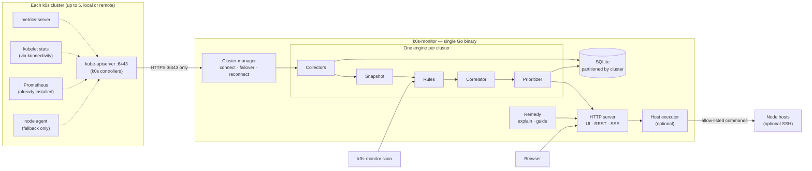

# k0s-monitor: implementation plan

Status: M0, M1, M2 and M4 are done. M3 is built except its usability round with participants, and M5 except the optional node agent (section 17). The decisions are in section 18.

## Contents

1. [Summary](#1-summary)
2. [Goals and non-goals](#2-goals-and-non-goals)
3. [Main use cases](#3-main-use-cases)
4. [Architecture](#4-architecture)
5. [Connecting to clusters: local, remote, several at once](#5-connecting-to-clusters-local-remote-several-at-once)
6. [Data sources](#6-data-sources)
7. [Detection catalog](#7-detection-catalog)
8. [Grouping, correlation and prioritization](#8-grouping-correlation-and-prioritization)
9. [Health monitoring thresholds and forecasting](#9-health-monitoring-thresholds-and-forecasting)
10. [Helping to resolve issues](#10-helping-to-resolve-issues)
11. [UI and screens](#11-ui-and-screens)
12. [API and data model](#12-api-and-data-model)
13. [Security and RBAC](#13-security-and-rbac)
14. [Deployment options](#14-deployment-options)
15. [Repository layout](#15-repository-layout)
16. [Testing strategy](#16-testing-strategy)
17. [Milestones](#17-milestones)
18. [Decisions](#18-decisions)
19. [Risks and mitigations](#19-risks-and-mitigations)

---

## 1. Summary

**k0s-monitor** is a single Go binary that watches **up to 5 k0s clusters at once**. The clusters can be local or remote, and each one needs nothing more than HTTPS access to its API server. The tool runs as a service on a Linux jump host and is used from a browser, for example on Windows 10, over the LAN. It reuses the Prometheus already running in your clusters. For every cluster it:

1. **Detects problems** continuously across nodes and VMs, workloads, storage, networking and the k0s control plane. Section 7 lists about 60 rules.
2. **Groups symptoms under their root cause and ranks the causes.** For example, a dead node that takes down 14 pods is reported as one P1 issue, not 15 alerts.
3. **Shows each issue in a small web UI** with evidence: `kubectl describe` output, events, logs (current and previous container), metrics and recent changes.
4. **Helps resolve each issue** with a plain-language explanation, the checks it ran, the likely cause and ready-to-run commands. It never changes anything in your clusters itself: people make the change, with the exact command in hand. The k0s version and configuration come only with your product's updates.
5. **Monitors health**: volumes filling up (with a time-to-full forecast), node filesystem, CPU and memory pressure, VM-level signals (CPU steal, clock skew, disk latency), certificate expiry, and health per controller, including etcd. It reads most of this from your existing Prometheus.

An **All clusters** page shows every cluster's health, P1 count and connection state on one screen. The same engine is also available as a CLI (`k0s-monitor scan`) for CI jobs, cron and quick terminal checks.

A **Basic / Full** switch changes the whole UI between plain language, for people who don't work with Kubernetes every day, and full technical detail for k0s experts (section 11.1).

Screenshots of the UI are in [section 11](#11-ui-and-screens).

## 2. Goals and non-goals

**Product goal.** People who use products built on k0s should be able to run them with confidence, without feeling that Kubernetes is too much for them. k0s experts should still get every detail they need.

| Audience | Who | What they need | Default mode |
|----------|-----|----------------|--------------|
| Non-experts | Operators and customers who run a product built on k0s, IT generalists | Is everything OK? What do I do now? Is it safe to do? | Basic |
| k0s experts | Your support engineers, platform team, partners | Evidence, root causes, raw output, exact commands | Full |

**Design rules that follow from the goal**

- Say what is wrong and what to do, in plain words, before any technical detail.
- Show what is working, not only what is broken. Every overview has a "What we checked" list.
- Lead with one recommended fix. Say what it changes, how long it takes and whether it can be undone.
- Be read-only. The tool explains and guides, and people make the change themselves, with the exact command in hand.
- Technical terms explain themselves on hover (a built-in glossary).
- Getting help is one click away, through a report for support (section 10.6).

**Goals**

| # | Goal | Measurable target |
|---|------|-------------------|
| G1 | Quick to start | From installing on the jump host to the first prioritized results in under 5 minutes. Upload the cluster file, and results appear within 30 s. Nothing has to be installed in the clusters: an existing Prometheus is found and used automatically, and the tool also works without one. |
| G2 | Root causes first | One incident appears as one row. Symptoms are folded under their cause. |
| G3 | Explains and helps fix | Every rule has an explanation, evidence and resolution steps with concrete commands. |
| G4 | Monitors health, not only failures | Volume forecast, node and VM signals, certificates, control plane. |
| G5 | Understands k0s | Handles controllers that are not nodes, konnectivity, kube-router, Helm `Chart` CRs, Autopilot and the host paths k0s uses. |
| G6 | Safe | **Read-only.** v1 never changes anything in your clusters. It reads Secrets only if allowed: the certificates in TLS Secrets, and a Secret someone opens; values are shown only when turned on, on request, and logged (section 18). The only write is the optional creation of its own read-only account when you add a cluster (section 5.3). SSH is off. |
| G7 | Lightweight | Under 150 MiB RAM for each cluster of 100 nodes and 5,000 pods. Typical small k0s clusters need about 50–80 MiB each. |
| G8 | Remote and several clusters | Up to 5 clusters per instance, local or remote. An unreachable or slow cluster never affects the others. |
| G9 | Approachable for non-experts | In Basic mode, a non-expert can go from "something is wrong" to a safe fix without reading Kubernetes documentation. This is checked with real users (section 16). |

**Non-goals for v1**

- It does not replace Prometheus or Grafana. It reads from your Prometheus and never writes to it. Its own storage keeps only findings, the audit log and, where Prometheus is missing, a small local history.
- It is not a log aggregation system. It reads logs on demand from the API server.
- It does not change anything in your clusters. It explains and guides, and people make the changes themselves. One-click fixes can be added later (section 10.1).
- It does not manage a fleet of dozens of clusters. One instance is sized for up to 5 clusters. For more, run several instances.
- v1 has named users with the same rights: each person signs in with their own name and password, and the audit log and acknowledgements say who. Roles, per-user cluster access and single sign-on can be added later (section 13).

## 3. Main use cases

| Question | Where the answer is |
|----------|---------------------|
| I'm not a Kubernetes expert. Is everything OK, and what should I do? | **Basic mode**: a plain-language overview with "Fix these first" and "What we checked". |
| Which of my clusters needs attention right now? | **All clusters**: health score, P1 count, running product updates and connection state for each cluster. |
| How do I add a cluster, and why can't it connect? | **Add cluster**: upload or paste the cluster file, then a connection test that checks DNS, TCP, TLS and certificate names, authentication, k0s version and permissions, each with the fix. |
| Something is wrong. Where do I start? | **Overview** of a cluster: the health score and a "Fix first" list of root causes. |
| Why is this pod crashing? | **Pod detail**: Describe, Events, Logs and YAML tabs, next to a problem panel that shows the evidence, what changed, the checks run and how to fix it. |
| Will a volume fill up tonight? | **Storage**: PVC usage, a 24 h trend and the time until full. |
| Is a VM sick? | **Nodes & VMs**: node conditions, usage, VM signals and a breakdown of what is using the disk. The optional SSH diagnostics can also look inside the host. |
| Is the k0s control plane OK? When do the certificates expire? | **k0s control plane**: health per controller, `readyz` checks, etcd, add-ons, certificates, Helm charts and Autopilot. |
| Do all servers run the k0s version my product ships? | **k0s system**: the version of every controller and server compared with your product's version, and the progress of a running product update. |
| Can CI fail when a cluster is unhealthy? | `k0s-monitor scan --cluster edge-prod --fail-on P1 -o json` |

## 4. Architecture



### Evaluation loop

Each cluster has its own loop. A slow or unreachable cluster never delays the others.

1. **Collectors** keep an in-memory cache.
   - Shared informers watch Kubernetes objects.
   - Pollers query Prometheus, `readyz` on each controller and certificates, plus the fallbacks (metrics-server, kubelet stats, agent) where needed, each on its own interval.
2. When an informer event arrives, the snapshot is marked dirty. A debounced **evaluation** then runs, at most once every 10 s and at least once every 60 s.
3. Each evaluation produces an immutable **snapshot** with indexes: pods by node, pods by owner, services by selector, PVCs by pod, and so on. Rules only read the snapshot. They never call the API directly, which keeps them fast, deterministic and easy to test.
4. **Rules** return raw findings. The **correlator** aggregates them and folds symptoms under root causes. The **prioritizer** scores the result.
5. The new result is diffed against the previous one. The diff produces `opened`, `updated` and `resolved` events. These events are stored in SQLite and pushed to browsers over SSE, where they become in-UI notifications (section 11.2).

### Components

| Component | Responsibility |
|-----------|----------------|
| `fleet` | The cluster manager: adds and removes clusters at runtime, keeps one engine per cluster, fails over between API endpoints, reconnects with backoff, runs the connection test, and marks data as stale. |
| `cluster` | Loads the kubeconfig or in-cluster config for one cluster, including the proxy settings. Probes capabilities: k0s detection, Prometheus and its exporters, metrics API, `readyz`, `nodes/proxy`, agent. |
| `collector` | Informers for about 25 resource kinds, pollers, and a budgeted log fetcher. |
| `prom` | Finds Prometheus in each cluster, maps its labels to nodes and PVCs, and runs budgeted instant and range queries (section 6.1). |
| `snapshot` | An immutable view of one cluster plus lookup indexes. |
| `rules` | One detector per rule, with metadata: ID, category, default severity, required capabilities, remediation template. |
| `correlate` | Aggregates by owner. Folds symptoms under a root cause through declarative edges (section 8.2). |
| `priority` | Computes the score, the P1–P4 bucket and the health score for each category. |
| `remedy` | Explanations, command templates, log-pattern library, "what changed" diffs, fix guides with exact commands, and the add-node guide. |
| `hostexec` | Optional SSH executor for allow-listed host commands (section 10.3). It is compiled in but disabled unless configured. |
| `store` | SQLite, partitioned by cluster: finding history, metric samples for forecasting, audit log, acknowledge and snooze state. |
| `web` | HTTP server, HTML templates, REST API, SSE and embedded static assets. |
| `notify` | In-UI notifications: decides what notifies, keeps the unread state, and feeds the bell, the tab title and browser desktop notifications (section 11.2). |
| `agent` | Optional fallback DaemonSet for VM and host signals that Prometheus does not provide (section 7.3). |

### Technology choices

| Area | Choice | Why |
|------|--------|-----|
| Language | Go (current stable) | The Kubernetes ecosystem language. k0s itself is Go. Builds a single static binary. |
| Kubernetes access | `client-go` (typed and dynamic), `k8s.io/metrics` | Informers, discovery for k0s CRDs that may or may not exist, and built-in support for HTTP and SOCKS5 proxies. |
| Describe output | `k8s.io/kubectl/pkg/describe` | Gives output identical to `kubectl describe` for every kind. |
| Storage | SQLite through `modernc.org/sqlite` (pure Go, no CGO) | Zero-ops persistence in a single file. |
| SSH (optional) | `golang.org/x/crypto/ssh` | No external `ssh` binary. Host keys are pinned. |
| UI | Server-rendered HTML (`html/template`), a small amount of vanilla JS (no framework, no htmx), SSE, and inline SVG charts rendered on the server. A strict Content-Security-Policy allows no inline script or style. | No Node toolchain, one binary, fast pages, easy to contribute to. |
| Assets | Embedded with `go:embed`. No CDNs. | Works in air-gapped and edge environments, which are common for k0s. |

> **Alternative considered:** a React or Vite single-page app. It would be more interactive, but it adds a second language and a JS build chain, and none of the screens need it. The REST API (section 12) is complete, so a SPA can be added later without touching the backend.

## 5. Connecting to clusters: local, remote, several at once

### 5.1 Where the tool runs

**The intended setup: a Linux jump host on the LAN, used from a browser on Windows 10 or later.**

- k0s-monitor runs as a systemd service on the jump host, which reaches every cluster directly over the LAN. No proxy or tunnel is needed.
- You open `https://<jump-host>:8443` in Edge or Chrome on Windows 10. Nothing is installed on the Windows machine.
- The jump host is the only machine that needs network access to the clusters, and the only place credentials are stored.
- v1 has named users, all with the same rights. Sign-in and HTTPS are described in section 13, and installation in section 14.

Other placements still work: a laptop for ad-hoc use, or inside one of the clusters.

### 5.2 Remote access

All data goes through the API server: logs, kubelet stats through konnectivity, and Prometheus and agent data through the API server's service proxy. So **the only network requirement is HTTPS to port 6443** of each cluster. No node IPs or other ports need to be reachable. The one exception is the optional SSH feature.

What must be true for a remote cluster:

| Requirement | Details |
|-------------|---------|
| Reachable address | The kubeconfig `server:` must be an address the tool can reach: a controller IP, a load balancer in front of the controllers, or `spec.api.externalAddress`. |
| Address in the certificate | The address must be in the API server certificate. Add it to `spec.api.sans` in `k0s.yaml` and restart the controller so it issues a new certificate. This is the most common remote-access failure, and the connection test detects it. |
| Credentials | Upload whatever kubeconfig you have, even an admin one from `sudo k0s kubeconfig admin` or `k0sctl kubeconfig`. The Add cluster page can swap it for a read-only account (section 5.3). |
| Bastion or private network | Not needed in your setup, because the clusters are on the LAN. If it is ever needed: set an HTTP or SOCKS5 proxy per cluster (`proxy-url` in the kubeconfig, or `proxy:` in the tool's config), or an SSH tunnel through a bastion host that the tool manages. |

**Connection test.** It runs when you add a cluster and on demand. It checks, in order:

1. DNS resolution.
2. TCP reachability and latency.
3. TLS: the certificate chain, the expiry, and whether the address is in the certificate.
4. Authentication.
5. k0s detection (version, datastore, number of controllers).
6. Each controller endpoint.
7. Permissions.

Every failure comes with the fix. Missing permissions never block the connection. They only disable the features that need them.

**Per-controller checks and failover.** You can list every controller address in addition to the kubeconfig server.

- The tool checks `/readyz` and `/livez` on each controller on its own, which covers k0s controllers that are not Nodes.
- It reports a dead controller as an issue.
- If the endpoint in use stops answering, it moves to the next healthy one.
- Endpoints that fail the TLS name check are skipped for failover until they are fixed.

**Unreliable links.**

- Watches resume from the last resourceVersion after a reconnect.
- Reconnects use exponential backoff.
- Polling intervals stretch automatically when latency is high.
- When a cluster cannot be reached, its last data stays visible, labeled **stale** with the time of the last successful sync, and a fleet-level "cluster unreachable" issue is opened.

### 5.3 Adding a cluster: upload or paste its file

On the **Add cluster** page, you can drop one or more files, choose them, or paste their content. The type is detected from the content, not from the file name.

| File | How it is recognized | What it gives |
|------|----------------------|---------------|
| Kubeconfig, for example `cluster.config` or `~/.kube/config` | `kind: Config` with clusters, users and contexts | Access to the API server. **Required.** |
| k0sctl cluster file (`k0sctl.yaml`) | `apiVersion: k0sctl.k0sproject.io/…`, `kind: Cluster` | Controller and worker addresses, the expected layout and k0s version, and the embedded k0s config. SSH details are ignored unless host access is enabled. |
| k0s config (`k0s.yaml`) | `apiVersion: k0s.k0sproject.io/…`, `kind: ClusterConfig` | The expected configuration: API address and SANs, network provider, storage, extensions and worker profiles. It is used to find drift and to explain settings. |

- A kubeconfig with several contexts shows a picker.
- `k0sctl.yaml` and `k0s.yaml` contain no API credentials. If only one of them is given, the page asks for a kubeconfig too. With SSH host access (M6), the kubeconfig could be fetched from a controller the same way `k0sctl kubeconfig` does it.

**Checks and fixes on upload**

- A server address of `localhost` or `127.0.0.1` is flagged. This is typical when the kubeconfig was copied on a controller. The page offers the external address, or a controller address from `k0sctl.yaml`, instead.
- An expired client certificate or token is reported before connecting.
- The layout found in the cluster is compared with `k0sctl.yaml`, for example "expected 3 workers, found 2".

**Swap admin credentials for a limited account (recommended)**

Uploaded kubeconfigs are usually admin kubeconfigs. The page offers to:

1. use them once to create a ServiceAccount, ClusterRole, binding and token for k0s-monitor, with read-only rights, after a server-side dry-run;
2. keep only the new token and discard the admin credentials.

This is the only time k0s-monitor writes a Secret, and only when you choose to. Experts can instead keep the uploaded credentials as they are (Full mode only). They are stored encrypted.

The uploaded `k0s.yaml` or `k0sctl.yaml` can be replaced later from the cluster's settings. The same import is available as `POST /api/v1/clusters/import` and as `k0s-monitor cluster add --file cluster.config`.

### 5.4 Several clusters at once

The tool is sized for **up to 5 clusters per instance**.

- **Isolation.** Each cluster gets its own engine: collectors, snapshot, rules, correlator and store partition. One cluster's outage, slowness or permission problem has no effect on the others.
- **Adding clusters.** Clusters come from the config file (section 14) or from the **Add cluster** page, and can be added or removed without a restart.
- **Shared cache.** All browser tabs share one cache per cluster, so opening more tabs does not add load on your API servers. Following the same pod's logs in two tabs uses one upstream stream.
- **Resources.** Memory is roughly the sum of the per-cluster needs. For 5 small or medium k0s clusters, expect about 250–500 MiB. The default memory limit is 1 GiB.

### 5.5 Capability probe

The probe runs for each cluster on connect and every 5 minutes. The UI shows the results under "Data sources".

| Capability | How it is detected | If it is missing |
|------------|--------------------|------------------|
| Cluster is k0s | Server version contains `+k0s`, and the `*.k0sproject.io` API groups exist | Works as a generic Kubernetes monitor and hides k0s-specific rules and views. |
| Metrics API | `v1beta1.metrics.k8s.io` APIService is Available | CPU and memory rules are disabled. Rule C06 reports the APIService as down. |
| Kubelet stats | `SelfSubjectAccessReview` for `get nodes/proxy`, plus a test call | Only needed when Prometheus lacks kubelet volume metrics. Otherwise volume usage is missing, and the UI explains why. |
| API server health and metrics | Access to the non-resource URLs `/readyz`, `/livez`, `/metrics` | Control plane checks are limited to what the API itself shows. |
| Prometheus | Found automatically (section 6.1), or a URL set for the cluster. Test queries check which exporters it has: node-exporter, kubelet volume metrics, cAdvisor. | Each missing exporter disables only the rules that need it, and the fallbacks take over (kubelet stats, metrics-server, the agent). |
| Node agent | The agent Service exists and answers through the API server's service proxy | Only needed for the rules that Prometheus cannot cover (V04, and V05 without the systemd collector). |
| SSH hosts | SSH is configured for the cluster | Host diagnostics are hidden (section 10.3). |

### 5.6 k0s specifics that shape the design

| k0s behavior | Impact on k0s-monitor |
|--------------|-----------------------|
| Controllers run as host processes and are **not Kubernetes Nodes**, unless `--enable-worker` or `--single` is used. | Control plane health comes from each controller's API endpoint (`/readyz`, `/livez`, `/metrics`), controller leases and Autopilot `ControlNode` objects. SSH can add more (section 10.3). The exact objects will be verified against the target k0s version in M3. |
| **Konnectivity** tunnels traffic from the API server to kubelets. | `kubectl logs`, `exec` and `port-forward`, kubelet stats, and agent data through the service proxy all depend on `konnectivity-agent` on each node. Rule X06 detects when this breaks. The UI explains why data for that node is missing instead of showing a raw error. |
| Default CNI is **kube-router**. Calico is optional. | CNI rules check whichever CNI is installed. |
| k0s deploys **CoreDNS** and **metrics-server** by default. | Health checks for both are built in. |
| k0s does **not install a default StorageClass**. | Rule S06 catches a very common k0s pitfall: PVCs stay Pending because no default StorageClass exists. |
| Host paths: data dir `/var/lib/k0s`, kubelet root `/var/lib/k0s/kubelet`, containerd socket `/run/k0s/containerd.sock`, systemd units `k0scontroller` and `k0sworker`. | The agent and the SSH commands use these paths. Remediation commands contain the correct paths, for example `crictl --runtime-endpoint unix:///run/k0s/containerd.sock …` and `journalctl -u k0sworker`. |
| Add-ons: Helm charts from `spec.extensions.helm` become `Chart` CRs (`helm.k0sproject.io`). The manifest deployer applies files from `/var/lib/k0s/manifests/`. | Rule C07 reports failed charts, and section 10.2 describes the chart views. k0s-monitor can itself be installed through either mechanism. |
| **The k0s version is fixed by your product** and changes only through product updates, which may use Autopilot `Plan`s (`autopilot.k0sproject.io`). | The tool never changes the k0s version. Rule C10 flags any controller or server that runs a different version than your product ships, and C08 reports a product update that is stuck or failed. C10 stays silent while an update is running. |
| Kubelet settings (eviction thresholds, log size) are set through **worker profiles** in the k0s configuration. | Shown read-only. When a fix needs a k0s configuration change, the tool says that it comes with a product update (section 10.2). |
| Versions look like `v1.xx.y+k0s.N`. | Rule C10 compares each node's version with the one your product ships. |

## 6. Data sources

All sources are collected per cluster, and all of them go through the API server. **Prometheus is the main source for metrics and history.** The other metric sources are fallbacks for clusters or exporters that are missing.

| Source | What it provides | How | Interval | Required |
|--------|------------------|-----|----------|:--------:|
| Watch API (informers) | Pods, Nodes, Events, Namespaces, Deployments, ReplicaSets, StatefulSets, DaemonSets, Jobs, CronJobs, Services, EndpointSlices, Ingresses, PVCs, PVs, StorageClasses, VolumeAttachments, HPAs, PDBs, ResourceQuotas, Leases, webhook configurations, APIServices, and k0s CRDs (Charts, Plans, ControlNodes, ClusterConfig) | list and watch | live | ✅ |
| Prometheus | Volume usage and history, node and VM signals, container memory and CPU throttling, and etcd metrics when k0s exports them. Details are in section 6.1. | PromQL through the API server's service proxy | 60 s | **main source** |
| Metrics API | CPU and memory per node and per pod, as a fallback | `metrics.k8s.io` | 30 s | fallback |
| Kubelet summary | Per-PVC `usedBytes`, `capacityBytes` and inodes. nodefs and imagefs usage. Ephemeral storage per pod. | `GET /api/v1/nodes/{n}/proxy/stats/summary` | 60 s | fallback |
| Kubelet config | The node's real eviction and image-GC thresholds | `GET /api/v1/nodes/{n}/proxy/configz` | 1 h | optional |
| API server health | Results of each check, per controller endpoint | `/readyz?verbose`, `/livez?verbose` on each listed controller | 30 s | optional |
| API server metrics | etcd database size (`apiserver_storage_size_bytes`), request latency, request errors | `/metrics` | 60 s | optional |
| TLS | Expiry of the API server serving certificate on each endpoint. Expiry of kubelet serving certificates, when the agent is present. | TLS handshake | 1 h | ✅ |
| Pod logs | Previous-container logs of crashing containers, for pattern analysis. Any logs on demand in the UI. | `pods/log` | on demand | ✅ |
| Node agent | Kernel log errors and systemd unit state (`k0sworker`, `k0scontroller`, `containerd`). It also covers the other VM signals where Prometheus is missing (section 7.3). | API server service proxy to the agent Service | 30 s | fallback |
| node-problem-detector | KernelDeadlock, ReadonlyFilesystem and similar conditions, plus kernel events | Node conditions and events (already watched) | live | optional |
| SSH (optional) | On-demand host diagnostics (section 10.3) | Allow-listed commands | on demand | optional |

**Load budget.** For each cluster, k0s-monitor fetches at most 20 logs per evaluation, tail 200 lines each. Results are cached per `(pod, container, restartCount)`, so a crashlooping pod is analyzed once per restart and not on every cycle. Kubelet summary calls are spread evenly across the 60 s interval. Over high-latency links, the polling intervals double automatically.

### 6.1 Using your existing Prometheus

**Finding it.** On connect, k0s-monitor looks in each cluster for:

- Prometheus Operator `Prometheus` objects (kube-prometheus-stack), or
- Services labeled `app.kubernetes.io/name=prometheus`, or
- Services named like `prometheus-operated`, `prometheus-k8s` or `prometheus-server`.

It then queries Prometheus **through the API server's service proxy**. That uses the same port 6443 and needs no extra network access. If your Prometheus runs outside the cluster, or behind an Ingress, set its URL for that cluster, with basic auth or a bearer token if needed.

**Checking it.** Test queries show which exporters are present. The connection test and the "Data sources" panel show the result, for example "node-exporter on 6 of 6 nodes, kubelet volume metrics, cAdvisor".

**What it is used for**

| Need | Metrics | Rules |
|------|---------|-------|
| Volume usage and inodes | `kubelet_volume_stats_used_bytes`, `_capacity_bytes`, `_inodes_used`, `_inodes` | S01 |
| Volume forecast | `predict_linear()` on `kubelet_volume_stats_used_bytes` over 6 h and 24 h, and a 7-day baseline | S02 |
| Node and host filesystems | `node_filesystem_avail_bytes`, `_size_bytes`, `_files_free` for `/` and `/var/lib/k0s` | N04, N05, V08 |
| CPU steal and iowait | `node_cpu_seconds_total{mode="steal"}` and `{mode="iowait"}` | V01, V02 |
| Disk latency | `node_disk_read_time_seconds_total` / `node_disk_reads_completed_total`, and the same for writes | V02 |
| Clock | `node_timex_offset_seconds`, `node_timex_sync_status` | V03 |
| Reboots | `node_boot_time_seconds` | V06 |
| Memory and swap | `node_memory_MemAvailable_bytes`, `node_memory_SwapFree_bytes` | N06, V07 |
| Read-only filesystems | `node_filesystem_readonly` | V04 (partly) |
| Services on the node | `node_systemd_unit_state`, only if node-exporter's systemd collector is enabled | V05 |
| Container memory and CPU throttling | `container_memory_working_set_bytes`, `container_cpu_cfs_throttled_periods_total` / `container_cpu_cfs_periods_total` | W02 (suggested limit from the 7-day peak), W17 |
| Scrape health | `up{job=~".*node-exporter.*\|kubelet"}` | Marks missing data as stale, and supports N01 |
| etcd, when controllers run with `--enable-metrics-scraper` | `etcd_mvcc_db_total_size_in_bytes`, `etcd_server_leader_changes_seen_total`, `etcd_disk_wal_fsync_duration_seconds` | C02 |
| Firing alerts (optional) | The alerts API (`/api/v1/alerts`), else `ALERTS{alertstate="firing"}` with `ALERTS_FOR_STATE` | Shown on the Alerts page and linked to the findings about the same object (M5) |

**What this changes**

- **Forecasts work from day one.** They use Prometheus history (up to its retention) instead of waiting for local samples.
- **`nodes/proxy` is not needed.** This powerful permission is only a fallback when kubelet volume metrics are missing.
- **The node agent is a fallback.** It is only required for kernel-log errors (V04) where neither node-problem-detector nor node-exporter runs, and for V05 unless the systemd collector is enabled.
- **Labels are mapped automatically.** Job names and `instance` labels differ between setups. node-exporter series are matched to Nodes by IP address or the `node` label. Mappings can be overridden per cluster.
- **Low load.** About 30 queries per evaluation per cluster. Range queries are cached. k0s-monitor never writes to Prometheus.

The exact metric names will be checked against your Prometheus in M2. The connection test reports any that are missing.

## 7. Detection catalog

Each rule is a Go function with metadata.

```go
Rule{
  ID:       "pod.crashloop",
  Category: Workloads,
  Severity: High,                   // default; raised to Critical when all replicas are down
  Needs:    []Capability{},         // e.g. {MetricsAPI} or {KubeletStats}
  Detect:   func(s *Snapshot) []Finding { ... },
  Remedy:   remedy.CrashLoop,       // explanation + checks + steps
}
```

Thresholds live in `config.yaml`, globally or per cluster. You can override them for a namespace or a single object with annotations, for example `k0s-monitor.io/pvc-warn: "90"`.

Every rule has **two texts**:

- a plain-language one for Basic mode: title, what happened, why, and what to do;
- a technical one for Full mode.

A test fails when a rule is missing either one (section 16).

The v1 scope is marked in the **M** column with the milestone that delivers it (section 17).

### 7.1 Workloads

| ID | Detects | Default severity | Evidence shown | Suggested resolution | M |
|----|---------|------------------|----------------|----------------------|:-:|
| W01 `pod.crashloop` | CrashLoopBackOff, or ≥ 3 restarts in 10 min | High. Critical if all replicas are affected. | Exit code and reason, previous-container logs, log-pattern matches, rollout diff | Explain the exit code, give a pattern-specific hint, roll back or fix the config | M0 |
| W02 `pod.oomkilled` | `lastState.terminated.reason = OOMKilled` | High | Limit compared with peak working set | Raise the limit to 1.5× the observed peak, or investigate a leak | M0 |
| W03 `pod.image-pull` | ErrImagePull, ImagePullBackOff, InvalidImageName | High | Registry message, classified as not found, unauthorized, rate limited, x509 error or DNS failure | Fix the tag, add an `imagePullSecret`, or add a registry mirror in the k0s containerd config. Optionally list tags when the registry is anonymous. | M0 |
| W04 `pod.config-error` | CreateContainerConfigError: a ConfigMap, Secret or key is missing | High | Event message | Create the missing object or key | M1 |
| W05 `pod.run-error` | CreateContainerError or RunContainerError, including `exec format error` (wrong CPU architecture, common on ARM edge nodes) | High | Event message plus the node's architecture | Use a multi-arch image or add a node selector | M1 |
| W06 `pod.unschedulable` | Pending with a FailedScheduling event | High, or Medium for a single pod | Parsed reasons (insufficient cpu or memory, taints, affinity, PVC, max pods) and the largest free allocatable on any node | Lower requests, add a node, or add tolerations | M0 |
| W07 `pod.stuck-creating` | ContainerCreating for more than 5 min (FailedMount, FailedAttachVolume, FailedCreatePodSandBox) | High | Events | Depends on the cause: storage or CNI | M1 |
| W08 `pod.stuck-terminating` | `deletionTimestamp` older than 5 min | Medium | Finalizers and the node's status | Force-delete if the node is gone, or fix the finalizer's controller | M1 |
| W09 `pod.not-ready` | Running but not Ready for more than 5 min | Medium | Probe configuration and `Unhealthy` events | Fix the probe path, port or timing | M1 |
| W10 `pod.probe-kills` | Liveness-probe failures that cause restarts | Medium | Events and restart timing | Tune `initialDelaySeconds` or `failureThreshold`, or add a `startupProbe` | M1 |
| W11 `pod.evicted` | Failed pods with reason Evicted | Low. Usually folded under a node rule. | Eviction message | Clean up. Fix the underlying node pressure. | M1 |
| W12 `deploy.unavailable` | `availableReplicas < replicas`, or `ProgressDeadlineExceeded` | Scales with the fraction of replicas down | Rollout status and revision | Roll back or fix the new revision | M0 |
| W13 `sts/ds.unavailable` | StatefulSet not ready. DaemonSet unavailable or misscheduled. k0s's own add-ons are left to X05–X07. | StatefulSets scale with the fraction of replicas down, like W12. DaemonSets High or Medium. | Per-pod status, and which pods an ordered StatefulSet is still waiting to create | Depends on the cause | M1 |
| W14 `job.failed`, `cronjob.failing`, `cronjob.missed` | BackoffLimitExceeded, consecutive failed runs, missed schedules | Medium | Last runs | Fix the image or command, or check `startingDeadlineSeconds` | M1 |
| W15 `hpa.maxed`, `hpa.no-metrics` | At maxReplicas for more than 30 min, or unable to fetch metrics | Medium | Current and target metric; the container without a request | Raise `maxReplicas`, fix metrics-server, or give the named container a request (or scale on a ContainerResource metric) | M2 |
| W16 `quota.exhausted` | ResourceQuota usage ≥ 90%, or FailedCreate with "exceeded quota" | Medium | Quota usage | Raise the quota or clean up | M2 |
| W17 `container.near-limit` | Memory ≥ 90% of the limit, or sustained CPU throttling | Medium | Usage compared with the limit | Adjust resources | M2 |
| H01–H07 hygiene | No limits, no probes, `:latest` tag, single replica with a blocking PDB (drain and product updates stall), privileged containers, old finished pods, monitoring Services for control plane pods k0s doesn't have | Low or Info | Object list | Best-practice fix | M3 |

### 7.2 Nodes

| ID | Detects | Default severity | Evidence | Resolution | M |
|----|---------|------------------|----------|------------|:-:|
| N01 `node.not-ready` | `Ready` is False or Unknown | Critical | Lease age, conditions, whether Prometheus still receives the node's metrics, affected pods and how many were rescheduled | Host checklist: VM power and network, `systemctl status k0sworker`, `journalctl -u k0sworker`, disk and OOM on the host. With SSH, the tool runs the checks itself. Cordon or drain. | M0 |
| N02 `node.pressure` | MemoryPressure, DiskPressure or PIDPressure | High | Condition, usage, evictions | Free resources. Details in N04 and V08. | M0 |
| N03 `node.network-unavailable` | NetworkUnavailable | High | CNI pod on the node | Fix the CNI (X05) | M1 |
| N04 `node.fs-high` | nodefs or imagefs at or above the warn threshold, before the kubelet's own eviction threshold | Medium, rising to High | What uses the space: images, container logs, emptyDirs, writable layers | Prune images, cap log size with a worker profile, set emptyDir `sizeLimit` | M2 |
| N05 `node.inodes-high` | Inode usage ≥ 85% | Medium | Summary API | Find the small-file producer | M2 |
| N06 `node.saturation` | CPU or memory ≥ 90% sustained for 15 min | Medium | metrics-server | Rebalance or add capacity | M2 |
| N07 `node.overcommit` | Sum of limits > 150% of allocatable, or requests > 90% | Low or Medium | Totals per node | Right-size workloads | M2 |
| N08 `node.cordoned-long` | Unschedulable for more than 24 h | Low | When it was cordoned, from the node's managed fields (the API keeps no other record) | Uncordon, or remove the node | M1 |
| N09 `node.pods-near-max` | ≥ 90% of `maxPods` | Medium | Pod count | Raise `maxPods` in a worker profile, or add a node | M2 |
| N10 `node.npd-condition` | node-problem-detector conditions: KernelDeadlock, ReadonlyFilesystem, FrequentKubeletRestart, FrequentContainerdRestart | High | Condition message | Host-level fix | M3 |

### 7.3 VM and host signals (from Prometheus node-exporter, or the node agent)

| ID | Detects | Default threshold | Severity | M |
|----|---------|-------------------|----------|:-:|
| V01 `vm.cpu-steal` | Hypervisor contention (noisy neighbour, overcommitted host) | ≥ 10% average over 5 min | Medium, or High at ≥ 25% | M2 |
| V02 `vm.iowait` / disk latency | Slow or overloaded disk | iowait ≥ 20%, or await ≥ 100 ms | Medium | M2 |
| V03 `vm.clock-skew` | NTP not synchronised (breaks TLS, tokens and etcd) | > 1 s warn, > 5 s high | Medium or High | M2 |
| V04 `vm.kernel-errors` | I/O errors, EXT4 or XFS errors, OOM killer, hung tasks, NIC link down | any NPD kernel event in 1 h; a host OOM kill or 2 link changes in 15 min | High (disk, oops, memory chips), Medium (OOM, link) | M5 |
| V05 `vm.service-down` | `k0sworker` or `k0scontroller` not active, or restarting often (k0s runs containerd inside the worker's service, so containerd has no unit of its own) | not active; 3 restarts in 15 min | Critical, or High while restarting | M5 |
| V06 `vm.reboot` | Unexpected reboot (uptime reset) | any | Low | M2 |
| V07 `vm.memory` | High swap use, or low memory outside Kubernetes accounting | swap > 50% | Low | M2 |
| V08 `vm.host-fs` | `/` or `/var/lib/k0s` filling up, including space kubelet does not see | 80 / 90% | Medium or High | M2 |

With your Prometheus, V01–V03 and V06–V08 come from node-exporter from M2 on. V05 also works if node-exporter's systemd collector is enabled. *Built in M5 without the agent:* V04 reads node-problem-detector's kernel monitor events (IOError, Ext4Error, XFSError, TaskHung, KernelOops, MemoryReadError, OOMKilling, UnregisterNetDevice) where it runs, and node-exporter's `node_vmstat_oom_kill` (less the containers OOMKilled at their own limit) and `node_network_carrier_changes_total` (pod and tunnel interfaces left out). The agent would only add the kernel log where neither runs.

The **node agent** is a small Go binary, about 20 MiB RSS. It is a fallback, installed only where it is needed.

- It mounts `/proc`, `/sys`, `/var/lib/k0s` and `/var/log/journal` read-only. It reads the kernel log from journald, so it does not need `/dev/kmsg` or privileged mode.
- It needs `hostPID` only to read systemd unit state. This can be disabled, which disables V05.
- It exposes `/v1/signals` through a ClusterIP Service. k0s-monitor reads it through the API server's service proxy, so it also works when the tool runs remotely. A NetworkPolicy blocks every other client.
- The agent is **read-only by design**. It never runs commands, so it can never be used as a remote shell. Host actions exist only through the optional SSH executor (section 10.3).

### 7.4 Storage

| ID | Detects | Default severity | Evidence | Resolution | M |
|----|---------|------------------|----------|------------|:-:|
| S01 `pvc.usage` | Bytes or inodes used ≥ 80, 90 or 95% | Medium, High or Critical | Usage and trend | Clean up or expand | M2 |
| S02 `pvc.fill-forecast` | Full within 24 h (High) or within 6 h (Critical) | High or Critical | Growth rate, baseline, projected time | Find what is growing. Expand the volume as a stop-gap. | M2 |
| S03 `pvc.pending` | Pending for more than 2 min. Reasons: no default StorageClass, provisioner error, or WaitForFirstConsumer with an unschedulable pod. | High | Events and the StorageClass | Create or mark a default StorageClass, or fix the provisioner | M0 |
| S04 `pv.released/failed` | Released or Failed PVs | Low or Medium | Reclaim policy | Clean up or recover | M2 |
| S05 `volume.mount-failure` | FailedMount, FailedAttachVolume, Multi-Attach error | High | Events | Detach, or fix the CSI driver | M1 |
| S06 `sc.no-default` | No default StorageClass while some PVCs have no class set | Medium | StorageClass list | `kubectl patch storageclass … is-default-class=true`, or install a provisioner | M1 |
| S07 `pvc.resize-stuck` | `FileSystemResizePending` for more than 10 min | Medium | Conditions | Restart the pod, if the CSI driver needs an offline resize | M2 |
| S08 `pod.ephemeral-high` | Pod ephemeral storage close to its limit or to node eviction | Medium | Summary API | Set limits, or move the data to a PVC | M2 |

### 7.5 Network

| ID | Detects | Default severity | M |
|----|---------|------------------|:-:|
| X01 `svc.no-endpoints` | A Service with a selector and 0 ready endpoints. High if an Ingress or LoadBalancer exposes it. | High or Medium | M0 |
| X02 `svc.selector-mismatch` | A selector that matches no pods at all (often a typo) | Medium | M1 |
| X03 `ingress.backend-missing` | An Ingress that references a Service or port that does not exist | Medium | M1 |
| X04 `dns.unhealthy` | CoreDNS not ready. Optional active probe that resolves `kubernetes.default`. | Critical | M0 |
| X05 `cni.unhealthy` | kube-router or Calico pod not ready on a node, or FailedCreatePodSandBox with CNI errors | Critical for the node | M1 |
| X06 `konnectivity.agent-down` | konnectivity-agent missing or not ready on a node, so logs, exec, kubelet stats and agent data fail for that node (k0s-specific) | High | M1 |
| X07 `kube-proxy.unhealthy` | kube-proxy not ready | High | M1 |
| X08 `lb.pending` | A LoadBalancer Service without an external IP for more than 10 min (no MetalLB or other load balancer installed) | Medium | M1 |

### 7.6 Control plane (k0s) and connectivity

| ID | Detects | Default severity | M |
|----|---------|------------------|:-:|
| C01 `apiserver.readyz` | Any failing `/readyz` check on any controller | Critical if all controllers fail, High for one | M3 |
| C02 `etcd.health` | The etcd readiness check fails, or the database is above 70% or 85% of its quota | Critical or High | M3 |
| C03 `controllers.count` | Fewer live controllers than expected (from per-controller checks, leases or ControlNodes compared with configuration) | High | M3 |
| C04 `cert.expiry` | A certificate expires in less than 30 days (Medium) or less than 7 days (Critical) | Medium to Critical | M3 |
| C05 `webhook.blocking` | A webhook with `failurePolicy: Fail` whose Service has no endpoints. It **blocks every matching create or update.** | Critical | M1 |
| C06 `apiservice.unavailable` | An aggregated API is down. This breaks namespace deletion and HPAs. | High | M1 |
| C07 `k0s.chart-failed` | A `Chart` CR is in an error state | High | M3 |
| C08 `k0s.update-stuck` | A product update that uses Autopilot is stuck or failed on some nodes | High | M3 |
| C09 `ns.stuck-terminating` | A namespace in Terminating for more than 10 min | Medium | M1 |
| C10 `k0s.version-drift` | A controller or server runs a k0s version other than your product's, or versions differ between nodes, while no product update is running. This usually means a manual change or an unfinished update. | Medium | M3 |
| C11 `events.warning-spike` | Warning-event rate at 5× its baseline | Medium | M2 |
| F01 `cluster.unreachable` | The tool lost its connection to a cluster (all endpoints fail). This is a fleet-level issue. | Critical after 2 min | M1 |
| F02 `endpoint.tls-name` | A controller endpoint's certificate does not include the address used for it | Medium | M3 |

### 7.7 Log-pattern library

The library is a YAML file that you can extend. It is used to explain crashes and to link a crash to other findings.

```yaml
- id: dns.no-such-host
  match: '(?i)(no such host|temporary failure in name resolution|server misbehaving)'
  explain: "The app cannot resolve a hostname. Check that the Service name and namespace are correct and that CoreDNS is healthy."
  checks: [coredns-healthy, referenced-service-exists]
- id: net.connection-refused
  match: '(?i)connection refused'
  explain: "The target is reachable but nothing listens on that port. The dependency may be down or the port may be wrong."
- id: arch.exec-format
  match: 'exec format error'
  explain: "The image was built for a different CPU architecture than this node."
- id: fs.no-space
  match: '(?i)no space left on device'
  explain: "A volume or the node filesystem is full."
  links: [pvc.usage, node.fs-high]
- id: tls.x509
  match: 'x509: certificate (has expired|signed by unknown authority|is valid for)'
- id: jvm.oom
  match: 'java.lang.OutOfMemoryError'
# … permission denied, address already in use, too many open files, read-only file system, …
```

**Exit codes** are always translated:

| Code | Meaning |
|------|---------|
| 0 | Completed. If the pod is restarting, the process exits on purpose, so check the command or `restartPolicy`. |
| 1 | Application error |
| 126 | Command not executable |
| 127 | Command not found |
| 137 | SIGKILL: OOM kill or liveness-probe kill (checked against `OOMKilled` and events) |
| 139 | Segmentation fault |
| 143 | SIGTERM |

## 8. Grouping, correlation and prioritization

Everything in this section runs per cluster. The All clusters page only aggregates the results.

### 8.1 Aggregation

Identical findings for the same owner are merged. For example, 3 crashlooping pods of one ReplicaSet become one Deployment-level finding: "3/3 pods CrashLoopBackOff".

Each finding has a stable fingerprint, `sha1(clusterID + ruleID + owner UID)`. Acknowledge, snooze and history survive pod churn because of it.

### 8.2 Root-cause correlation

Symptoms are folded under their cause through declarative edges that are matched against the snapshot indexes.

| Root cause | Symptoms folded under it |
|------------|--------------------------|
| `node.not-ready` | Pods on that node that are Unknown or Terminating. DaemonSet pods unavailable on that node. Workloads that are degraded only because of that node. konnectivity, CNI and kube-proxy pods on that node. |
| `node.pressure` (disk) | Pods evicted from that node |
| `node.not-ready`, `node.pressure` | `pod.unschedulable` for pods that only these nodes could run and that are kept away only by their condition taints (not ready, unreachable, disk, memory or PID pressure). The pods start by themselves once the nodes recover. |
| `pod.*` on the CoreDNS deployment | `dns.unhealthy` |
| `pod.crashloop` (all replicas) | `svc.no-endpoints` for Services that select those pods, then Ingress backends that return 503 |
| `pvc.pending` | `pod.unschedulable` and `pod.stuck-creating` for pods that use the PVC |
| `pod.unschedulable` | `pvc.pending` for its WaitForFirstConsumer PVC (the reverse edge) |
| `cni.unhealthy` (node) | FailedCreatePodSandBox pods on that node |
| `dns.unhealthy` | Crashes whose logs match `dns.*` patterns |
| `konnectivity.agent-down` | "Logs unavailable" errors, missing kubelet stats and missing agent data for that node |
| `apiservice.unavailable` | `ns.stuck-terminating` and `hpa.no-metrics` |
| `webhook.blocking` | ReplicaSet and StatefulSet FailedCreate events that mention the webhook |
| `cluster.unreachable` | Every finding for that cluster. They are kept, marked stale, and their state is not changed while the cluster is unreachable. |

Folded symptoms stay visible when you expand an issue, but they do not add to the P1–P4 counts. One incident is one row. A root cause is as urgent as its worst symptom: when a symptom scores higher, the root takes that score, and its evidence says why. For example, a full disk that keeps CoreDNS from starting is P1, not P2.

### 8.3 Priority score

```
score = base(severity) + impact + criticality + urgency − damping        (clamped to 0…100)
```

| Term | Values |
|------|--------|
| **base** | Critical 60 · High 45 · Medium 30 · Low 15 · Info 5 |
| **impact** (0…25) | All replicas of a workload down +20 · ≥ 50% down +12 · one replica of many down +4 · cluster-wide component (API server, etcd, CoreDNS, CNI, konnectivity) +25 · +1 per affected pod on a node, up to +20 · exposed through an Ingress or LoadBalancer +5 |
| **criticality** (−10…+10) | `kube-system` or k0s components +10 · annotation `k0s-monitor.io/criticality: high` or `low` on the namespace or workload: +10 or −10 · per-cluster criticality in the config (for example, prod +5 and lab −10) |
| **urgency** (0…15) | Forecast breach within 1 h +15, 6 h +10, 24 h +5 · started less than 60 min after a rollout or config change +5 · getting worse (restart or growth rate rising) +3 · new in the last 15 min +3 |
| **damping** | Flapping (opened and closed 3 or more times in 1 h) −5. Acknowledged issues are removed from "Fix first" but stay in the list. |

**Buckets:** **P1 ≥ 75** fix now · **P2 50–74** fix today · **P3 25–49** plan · **P4 < 25** hygiene.

**Worked example** (`deploy/payments-api`):

- High base: 45.
- Impact: all 3 replicas down (+20), plus exposed through an Ingress (+5). That reaches the cap of 25.
- Criticality: namespace `shop` is annotated `criticality: high`, so +10.
- Urgency: started 2 min after rollout #13 (+5), and the restart rate is rising (+3).
- Total: 45 + 25 + 10 + 8 = **88, which is P1**.

A 94% volume that fills in about 3 days would be P3, but the same volume filling in about 4 h is P1. Urgency comes from time to full, not from percent used.

### 8.4 Health score

- Each **category** (Nodes & VMs, Workloads, Storage, Network, Control plane) starts at 100.
- A category loses **30 points per open P1 root cause, 12 per P2, 4 per P3 and 1 per P4**. It also loses **2 per folded symptom** that belongs to it, so an outage is visible in every area it touches without dominating them.
- The score never goes below 0.
- The **overall score** of a cluster is a weighted average: Nodes 25%, Workloads 25%, Storage 20%, Network 15%, Control plane 15%.
- **Labels:** ≥ 90 Healthy · 70–89 Warning · 50–69 Degraded · < 50 Critical. A cluster with an open P1 is labeled Warning at best, whatever its score: a single P1 costs a large cluster too few points to leave "Healthy" (found in the first usability walkthrough).
- An unreachable cluster shows no score. Instead it shows its last known score and the time it was computed.

The overview's health score uses exactly this formula.

### 8.5 Finding lifecycle

`open → acknowledged → snoozed (until time, or until the evidence changes) → resolved`.

A finding is **resolved** automatically when its condition is absent for 2 consecutive evaluations. Resolved findings stay in the history for 30 days, which answers "has this happened before?".

## 9. Health monitoring thresholds and forecasting

All thresholds can be set globally and overridden per cluster.

| Signal | Warn | High | Critical | Notes |
|--------|------|------|----------|-------|
| PVC used (bytes or inodes) | 80% | 90% | 95% | Per-object annotations can override these. |
| PVC time to full | — | < 24 h | < 6 h | Forecast method described below |
| Node nodefs or imagefs | 80% | 85% | 90% | Defaults match the kubelet defaults (image GC high at 85%, eviction at `nodefs.available<10%`). The real per-node values are read from `/configz` when available, so the warning always comes **before** the node starts evicting. |
| Node CPU or memory | 85% | 95% | — | Sustained for 15 min |
| CPU steal | 10% | 25% | — | 5 min average |
| iowait | 20% | 40% | — | 5 min average |
| Clock skew | 1 s | 5 s | — | From `node_timex_offset_seconds`, or compared with the API server's `Date` header |
| Certificate expiry | 30 d | — | 7 d | |
| etcd database size | 70% | 85% | — | Of the quota (2 GiB by default) |
| Restarts | 3 in 10 min | — | — | |
| Pending (Unschedulable) | 2 min | — | — | |
| ContainerCreating | 5 min | — | — | |
| Node NotReady | immediately | — | 1 min | |
| Cluster unreachable | 30 s | — | 2 min | Measured from the last successful sync |

**Forecasting.**

- **With Prometheus (your setup):** the forecast uses `predict_linear()` over Prometheus history, so it works from the first minute, and the baseline covers up to 7 days.
- **Without Prometheus:** samples are taken every 60 s and kept for 48 h. They are then downsampled to 10 min and kept for 7 days in SQLite. That is about 2 MB for 100 PVCs.
- The growth slope comes from a least-squares linear regression over the last 6 h, falling back to 24 h when the fit is poor (R² < 0.6).
- Time to full = (capacity − used) / slope, shown only when the slope is positive and at least 12 samples exist.
- The UI shows the current growth rate, the 7-day baseline, and whether the rate changed recently ("growth jumped 15× at 09:10").

## 10. Helping to resolve issues

Every finding gets three layers of help.

1. **Explain**: a plain-language summary, the evidence (events, log lines, exit code, metrics), the **checks run** with pass or fail results, and the **likely cause**.
2. **Guide**: numbered steps with commands that already contain the right names. Host-level commands (`k0s`, `systemctl`, `journalctl`, `crictl`) are labeled "run on host X".
3. **Act**: not in v1. k0s-monitor only tells you what to do, and people make the change themselves. One-click fixes can be added later (section 10.1).

**"What changed" correlation** often matters most. k0s-monitor keeps recent Deployment, StatefulSet and DaemonSet revisions and diffs the pod template around the time a failure started. For example: "rollout #13, 2 min before the first crash, changed `DB_HOST: postgresql → postgres`". It also watches ConfigMap **metadata only** (resourceVersion and timestamps, never the data) to flag "ConfigMap X changed 5 min before".

Every step is written so it can be followed without k0s-monitor: the exact command, what it changes, and whether it can be undone. Risky steps say "ask your support team first". The same steps go into the report for support.

### 10.1 One-click fixes (later, not in v1)

In v1, each of these appears as a fix guide with the command to run, not as a button. The design is kept so that one-click fixes can be added when you decide, with the guardrails in 10.5.

| Action | Kubernetes call | Guardrails | M |
|--------|-----------------|------------|:-:|
| Restart workload | Patch the `restartedAt` template annotation, same as `kubectl rollout restart` | Confirm | later |
| Roll back | Restore the template of revision N, same as `rollout undo --to-revision` | Shows the template diff | later |
| Scale | `scale` subresource | Configurable bounds | later |
| Set env or resources | Strategic-merge patch on the workload | Diff and dry-run | later |
| Delete pod | Delete. The controller recreates it. | Only for pods owned by a controller, unless forced | later |
| Force-delete stuck pod | Delete with grace period 0 | Only when the node has been NotReady for more than 5 min. Typed confirmation. | later |
| Clean up evicted or finished pods | Batch delete | Shows the exact list | later |
| Cordon, uncordon, drain | Patch the node, and use the Eviction API for drain | Drain respects PDBs, shows which pods will move and needs typed confirmation | later |
| Expand PVC | Patch `spec.resources.requests.storage` | Requires `allowVolumeExpansion`. Warns that volumes can grow but never shrink. | later |
| Re-run CronJob | Create a Job from the CronJob template | Confirm | later |

### 10.2 k0s: shown, never changed

**The k0s version and k0s configuration are managed by your product.** They change only through product updates, never manually. So k0s-monitor:

- **never** upgrades or downgrades k0s, and has no upgrade feature;
- shows k0s configuration and add-ons **read-only**;
- **detects drift.** Rule C10 flags any controller or server that runs a different k0s version than your product ships. Rule C08 reports a product update that is stuck or failed.

| Item | What the tool shows | M |
|------|---------------------|:-:|
| **k0s version** | The version of every controller and server, compared with the version your product ships. The expected version comes from the first available of: the cluster's `k0sVersion` setting, a product pack, an uploaded `k0sctl.yaml`, or the version the controllers run. | M3 |
| **Product update progress** | If your product's updates use Autopilot: the running update per node, and the reason when a node is stuck. | M3 |
| **Helm add-ons** (`Chart` CRs) | Status, chart version, values and errors. Values often hold passwords, so anything that looks like a password, token or key is hidden. *Built: k0s-monitor also drops the copy of the values k0s keeps in each Chart's annotations.* | M3 |
| **Cluster config and worker profiles** | The effective `ClusterConfig` and worker profiles, with explanations of the settings. If `k0s.yaml` was uploaded, the differences from it. *Built: k0s publishes its ClusterConfig only with dynamic configuration; without it, the view shows the uploaded `k0s.yaml` or `k0sctl.yaml`, and says so. Nodes don't record their worker profile, so the profiles are listed, not matched to nodes.* | M3 |
| **Add a node** | A guide that generates the commands, with your product's k0s version: `k0s token create --role=worker` on a controller, and `k0s install worker --token-file …` on the new host. The tool never creates join tokens itself, because a token is a cluster credential stored as a Secret. A product pack can replace this guide with your own procedure. *Built: the k0s program is copied from a controller (no internet needed), the ports to open follow the network provider, worker profiles are offered, a cluster with a k0sctl.yaml is pointed to `k0sctl apply`, and Full mode adds how to add a controller.* | M4 |

Remediation advice follows the same rule. When the real fix is a k0s version or configuration change, for example a larger container log limit in a worker profile, the tool doesn't give a command. It says "This is changed through a product update" and adds the details to the report for support.

### 10.3 Host access over SSH (optional, not decided yet)

Some problems cannot be seen through the Kubernetes API at all: a NotReady node, a stopped `k0sworker` service, a full root disk, etcd membership, backups. Host access over SSH closes that gap. It is **off by default** and not part of M0–M5. It would be milestone M6, only if you decide to use it.

**How it would work**

- It uses the host inventory and key from your `k0sctl.yaml`, or its own host list.
- Host keys are pinned, and it connects as a dedicated user whose `sudo` rights are limited to the allow-listed commands.
- There is **no interactive shell**. Only fixed commands from an allow-list can run, and the tool fills in only the arguments it validates itself.
- Every command and its output are recorded in the audit log.
- The tool's host needs SSH access to the nodes. This is easy from a jump host, but for an in-cluster install it needs extra network rules.

**Read-only diagnostics** (no confirmation needed): `k0s status`, `k0s sysinfo`, `k0s etcd member-list`, `systemctl is-active` and `status` for `k0sworker`, `k0scontroller` and `containerd`, `journalctl -u … -n 200`, `df -h`, `du -xhd1 /var`, `uptime`, `chronyc tracking` or `timedatectl`, and kernel errors from the journal.

**Host actions** (later, like other one-click fixes, and each would need typed confirmation):

- restart `k0sworker`,
- restart controllers one at a time, waiting for `readyz` between them,
- run `k0s backup` and download the archive,
- remove rotated container logs,
- remove a dead etcd member (`k0s etcd leave`), with an extra warning.

| | Without SSH (the default) | With SSH |
|---|---|---|
| NotReady node | A checklist of likely causes and commands to run yourself | Runs the checks and usually names the cause. For example: "root filesystem full, `k0sworker` cannot start". |
| Controllers | API-level health per controller | Also `k0s status`, etcd members and service logs |
| Backups | The command is shown | Run and download from the UI |
| Security | Only the Kubernetes API is used | The tool holds an SSH key to your nodes, limited by the allow-list and `sudo` rules |

**Recommendation:** build M0–M5 without it and decide after you have used the tool on your clusters. If you enable it, start with the read-only diagnostics. They give most of the value with little risk.

### 10.4 Shown as commands only (never run by the tool)

- k0s upgrades and k0s configuration changes are not offered at all. They come only with product updates (section 10.2).

- `k0s reset`, restoring from a backup, CA and certificate rotation, changing the datastore, and `k0s install`. These are destructive or hard to undo, or they need a person at the host.
- Creating join tokens, because a token is a cluster credential.

### 10.5 Guardrails, for when one-click fixes are added

- A separate ClusterRole is used, and it is bound only when actions are enabled. Actions can be enabled per cluster, for example allowed on staging and read-only on production.
- Every action goes through **preview**, which is a server-side dry-run (`dryRun=All`). The preview shows the diff and the equivalent `kubectl` command. SSH actions show the exact command.
- **Apply** needs the preview token, so the change applied is exactly the change previewed. It also needs a CSRF token.
- Each action is recorded in the **audit log**: who, which cluster, what, when, diff and result. The log is stored in SQLite, and a Kubernetes Event is also written on the object.
- Actions are denied in `kube-system` by default. Allow and deny lists per namespace are configurable.
- Later, with multiple users: actions can run through **impersonation** of the signed-in user, so each cluster's own RBAC decides what each user may do.

**Optional, M5: "Explain with AI".** This sends a redacted bundle of the finding (evidence, checks, masked env values) to an LLM provider you configure. It is off by default and never enabled implicitly. *Built: any OpenAI-compatible chat completions API, with presets for models on your own machines (Ollama, LM Studio, llama.cpp, vLLM) and cloud providers (OpenAI, Anthropic, DeepSeek, Qwen, Gemini, Mistral, OpenRouter). The key is stored encrypted; the bundle (the finding, what an update changed, its steps, symptoms, alerts, warning events and crash log lines) goes through the report's redaction, with IP addresses hidden by default, and the page shows it before it is sent. Each request is audited, and nothing is sent when the audit log can't be written. The answer streams in, in Basic or Full mode's style and the configured language, and is kept for a day.*

### 10.6 Getting help

- **Report for support.** In Basic mode this is "Download a report for support", in Full mode "Support bundle".
  - It is a zip file with an HTML summary: cluster versions, open findings with their evidence, `describe` output and log excerpts for the affected objects, and the capability probe results.
  - Secrets are never included. Env values with secret-like names and tokens are masked, and IP addresses can be masked too.
  - Users see what is inside before downloading it.
  - Milestone M4. *Built: the zip also holds the nodes, warning events, the k0s control plane and its ClusterConfig, as text and JSON. The preview frames the summary and lists every file to open; the prepared report is kept 30 minutes for the user who made it, and making and downloading it is audited. Secret-looking values are masked in logs, events and describe output too, and IP addresses become ip-1, ip-2, … consistently across the files when asked.*
- **Product packs.** Your team can package knowledge about your products as YAML, with no code:
  - extra checks, for example "our database volume must stay below 70%" or "component X needs 2 replicas";
  - plain-language texts and links to your documentation;
  - friendly names, for example `payments-api` shown as "Payments service".

  Packs are loaded from a directory or uploaded in the UI. Milestone M4. *Built: checks of six kinds (replicas, volume, exists, nodes, image tag and any PromQL query with a limit), friendly app names with documentation links, guides for built-in problems (what to do, likely cause, steps first, links), glossary words, the product's k0s version and its support contact. The format is documented by `packs/example.yaml`.*
- **Glossary and language.** The built-in glossary can be extended by product packs. All UI texts live in message catalogs, so translations can be added later.

## 11. UI and screens

The screenshots below are of the built UI, with the demo's made-up clusters (`make usability` serves similar ones).

**UI principles**

- Root causes come first.
- Every status color has a text label (P1, NotReady, and so on), so nothing depends on color alone.
- Every number links to its evidence.
- Commands are copyable.
- Updates arrive live over SSE.
- Keyboard: `/` opens search.
- It works at phone width for on-call use.
- The cluster switcher is always in the sidebar.

### 11.1 Basic and Full mode

A switch in the top bar changes how the whole UI presents the same information.

| Area | Basic mode | Full mode |
|------|------------|-----------|
| Wording | Plain language: "The app payments-api keeps crashing", "server", "storage volume" | Kubernetes terms: `deploy/payments-api` CrashLoopBackOff, node, PVC |
| Priorities | Fix now, Fix today, Plan ahead, Suggestions. The last two start folded. | P1–P4 with a 0–100 score |
| Root causes | One "Also affected" line | Expandable symptom tree |
| Health | "Needs attention" plus a "What we checked" list | Score per category and data-source status |
| App (pod) page | What happened, why, how to fix it, and the important log lines | Describe, Events, Logs and YAML tabs, checks, rollout diff |
| Fixes | One recommended fix first, explained, with its command | All options with their commands |
| Navigation | Overview, Problems, Apps, Servers, Storage, k0s system | Adds Network, Events, and rules and thresholds |

Rules for both modes:

- Both modes show the same findings in the same order. Only the wording and the amount of detail change. **Basic mode never hides a problem.**
- Switching modes keeps you on the same page.
- The choice is remembered. The tool starts in Basic mode, and `ui.defaultMode` in the config changes that.
- Terms with a dotted underline explain themselves on hover or keyboard focus.
- Every Basic page has a "Show technical details" link that opens the same page in Full mode.

### 11.2 Notifications (in the UI only)

- **Bell.** A bell in the top bar shows the number of unread notifications. Its panel lists them for all clusters, newest first, and each one opens its problem.
- **What notifies:**
  - a new "Fix now" or "Fix today" problem;
  - a problem that gets worse, for example from "Fix today" to "Fix now";
  - a cluster that can't be reached;
  - a "Fix now" problem that is resolved.

  "Plan ahead" and "Suggestions" don't notify, and acknowledged or snoozed problems stay quiet. The levels can be changed in the settings.
- **Browser tab.** The tab title shows the count, for example "(3) k0s-monitor", so it is visible while the tab is in the background.
- **Desktop notifications (optional).** Edge and Chrome can show "Fix now" problems as Windows 10 notifications while the page is open in a tab. This uses the browser's notification permission, which works because the UI uses HTTPS.
- **Nothing leaves the jump host.** No email, chat or webhooks.

### 11.3 Basic mode screens

#### Overview in Basic mode

A plain status line, "Fix these first" in plain words, and "What we checked", which also lists what is working.


#### Problems

Problems are grouped by urgency in words. "Plan ahead" and "Suggestions" start folded. Symptoms appear as one "Also affected" line. A button downloads a report for support.

#### An app that keeps crashing

The page answers what happened, why and how to fix it. The recommended fix comes first and says what it does, how long it takes and that it can be undone. It also shows what was checked and the important log lines.


#### Servers

Status and usage for each server, plain instructions for a server that stopped responding, and one recommended fix for low disk space.

#### k0s system

The k0s internals as plain checks, including whether every server runs your product's k0s version.

#### Add cluster in Basic mode

A file upload, a name and the account choice. Advanced connection options move to Full mode.

### 11.4 Full mode screens

#### All clusters

Health, P1 and P2 counts, the top issue, running product updates and the connection path for each cluster. An unreachable cluster shows the error, its retry state and a clear **stale** label. The summary tiles at the top include the instance's memory use.


#### Add cluster and connection test

The page works like this:

- **Upload.** Drop, choose or paste `cluster.config` (a kubeconfig), `k0sctl.yaml` or `k0s.yaml`. The type of each file is detected.
- **Automatic fixes.** A `localhost` server address is replaced with the external address from `k0sctl.yaml`.
- **Account.** Choose to create a read-only account (recommended), or in Full mode to use the uploaded credentials as they are.
- **Full mode options.** List every controller address, and choose a direct connection from the jump host, a proxy or an SSH tunnel.
- **Connection test.** It checks DNS, TCP, TLS, certificate names, identity, k0s version, the layout against `k0sctl.yaml`, each controller and the permissions. Every failure comes with its fix, for example a controller address missing from `spec.api.sans`.

#### Overview: "what is broken, and what do I fix first?"

This screen shows the health score per category, the data sources and their status, the "Fix first" list of root causes, the warning-event rate, storage hotspots with forecasts, and a strip of nodes.

#### Issues: the prioritized list, grouped by root cause

Each root cause has a score and a P1–P4 bucket, with its symptoms folded underneath. You can filter by priority, category and node, and acknowledge, snooze or export to JSON.

An issue's page shows its evidence, what an update changed, the log lines that matter, the steps to fix it and the Prometheus alerts about the same object.


#### Alerts

The firing alerts of the cluster's Prometheus, grouped by name and linked to the issues about the same object. Alerts can be hidden here only, for a time or while they fire.


#### Pod detail: describe, events, logs and the resolution panel

The tabs are **Describe** (real `kubectl describe` output), **Events**, **Logs** (current or previous container, follow, regex, pattern highlights, log insights) and **YAML** (secrets redacted). The right panel shows the evidence, **what changed** (the rollout diff), the checks run, the likely cause and the fix, with copyable commands.

#### Nodes and VMs: Kubernetes conditions plus VM signals

A NotReady node gets a host checklist. The table shows CPU, memory, disk and pods per node, plus VM signals from Prometheus: CPU steal, clock skew and whether the node's metrics still arrive. The node detail shows conditions (including node-problem-detector), host health, nodefs over 24 h against the real kubelet thresholds, a breakdown of what uses the disk, and k0s-specific fixes.


#### Host diagnostics over SSH (optional feature, not decided)

This is what SSH adds for the NotReady node. Read-only commands show that the VM is up but the root filesystem is full, so `k0sworker` cannot start. The dialog shows the journal and the fix commands to run. Without SSH, you get the checklist from the previous screen instead.

#### Storage: volumes close to full, with a forecast

This screen shows PVC usage, inodes, a 24 h sparkline and the time until full. The PVC detail shows the growth rate against its baseline, a projection line and likely causes. **How to expand…** opens a fix guide.


#### Fix guide dialog

The dialog shows what was checked (the StorageClass allows expansion, and the volume can grow while in use), the change, the exact command to run, and a warning that it can't be undone. k0s-monitor never runs the command itself.

#### k0s control plane

This screen shows health per controller (`readyz`, `livez`, latency, etcd role, which endpoint the tool uses), the version, the datastore, API server checks, etcd size, the add-ons k0s manages, certificate expiry, the k0s version of each node compared with your product's version, Helm `Chart` CRs, product update progress, admission webhooks and APIServices. Everything k0s-specific is read-only.


#### Dark theme


## 12. API and data model

### REST (JSON) and SSE

Everything specific to a cluster lives under `/api/v1/clusters/{cluster}`.

| Method and path | Purpose |
|-----------------|---------|
| `GET /api/v1/clusters` | All clusters: connection state, health, P1 and P2 counts, running product updates |
| `POST /api/v1/clusters` · `DELETE /api/v1/clusters/{c}` | Add or remove a cluster at runtime (admin only) |
| `POST /api/v1/clusters/import` | Upload files or pasted text. Returns the detected types, the suggested fixes and the account options. |
| `POST /api/v1/clusters/test` | Connection test for a new or existing cluster configuration |
| `GET /api/v1/clusters/{c}/health` | Overall and per-category scores, and the status of each data source |
| `GET /api/v1/clusters/{c}/findings?priority=&category=&namespace=&node=&symptoms=true` | Prioritized list |
| `GET /api/v1/clusters/{c}/findings/{id}` | Full detail: evidence, checks, remedy, history |
| `POST /api/v1/clusters/{c}/findings/{id}/ack` · `/snooze` | Change lifecycle state |
| `GET /api/v1/clusters/{c}/pods/{ns}/{name}` · `/describe` · `/events` · `/yaml` | Pod detail |
| `GET /api/v1/clusters/{c}/pods/{ns}/{name}/logs?container=&previous=&tail=&follow=` | Logs. Streams when `follow=true`. |
| `GET /api/v1/clusters/{c}/nodes` · `/nodes/{name}` | Node list and detail, including VM signals |
| `GET /api/v1/clusters/{c}/storage/pvcs` · `/storage/pvcs/{ns}/{name}/series` | PVC usage and time series |
| `GET /api/v1/clusters/{c}/prometheus` | Prometheus status: where it was found, exporters present, missing metrics |
| `GET /api/v1/clusters/{c}/controlplane` | Per-controller checks, etcd, add-ons, certificates, Charts, Plans |
| `POST /api/v1/clusters/{c}/hosts/{node}/diagnostics` | Optional SSH diagnostics (section 10.3) |
| `GET /api/v1/clusters/{c}/report` | Report for support (section 10.6), with a preview of its contents |
| `GET /api/v1/notifications` · `POST /api/v1/notifications/read` | In-UI notifications and their read state |
| `GET /api/v1/audit` | Audit log: sign-ins, added and removed clusters, downloaded reports |
| `POST /api/v1/session` · `DELETE /api/v1/session` | Sign in and sign out |
| `GET /api/v1/settings` · `PATCH /api/v1/settings` | Preferences, including the default mode |
| `POST /api/v1/password` | Change the password |
| `GET /api/v1/stream` (SSE) | `finding.opened`, `finding.updated`, `finding.resolved`, `health.changed`, `cluster.connected`, `cluster.disconnected`, `notification`, each tagged with its cluster |
| `GET /metrics` | Prometheus metrics about the tool itself, for example `k0s_monitor_findings{cluster="edge-prod",priority="P1"}` |
| `GET /healthz` | Liveness |

The HTML pages are rendered on the server from the same engine state. Their live parts (updates, logs, the Add cluster steps) use this API from small scripts.

### Finding model

```go
type Finding struct {
    ID          string       // stable fingerprint: sha1(clusterID + ruleID + ownerUID)
    Cluster     string       // "edge-prod"
    RuleID      string       // "pod.crashloop"
    Category    Category     // Nodes | Workloads | Storage | Network | ControlPlane | Hygiene | Fleet
    Severity    Severity     // Critical | High | Medium | Low | Info
    Score       int          // 0..100
    Priority    Priority     // P1..P4
    Title       string       // Full mode: "deploy/payments-api: CrashLoopBackOff (3/3 pods)"
    Summary     string
    Plain       PlainText    // Basic mode: {Title, WhatHappened, Why, AlsoAffected}
    Resource    ObjectRef    // owner-level object after aggregation
    Affected    []ObjectRef  // pods, nodes, services…
    ParentID    string       // set when folded under a root cause
    Evidence    []Evidence   // events, log excerpts, metric samples, conditions, diffs
    Checks      []Check      // {Name, Status: pass|fail|info, Detail}
    Remedy      Remedy       // {Explanation, LikelyCause, Recommended, Steps[{Text, PlainText, Command, Host, Undo}]}
    FirstSeen   time.Time
    LastSeen    time.Time
    Occurrences int
    Stale       bool         // true while the cluster is unreachable
    State       State        // open | acknowledged | snoozed | resolved
}
```

## 13. Security and RBAC

**Read-only ClusterRole** (the default, one per monitored cluster):

- `get`, `list` and `watch` on the core, `apps`, `batch`, `networking.k8s.io`, `storage.k8s.io`, `policy`, `autoscaling`, `admissionregistration.k8s.io`, `apiregistration.k8s.io` and `coordination.k8s.io` resources that k0s-monitor uses, plus the k0s CRD groups.
- `get` on `pods/log`.
- `get` on `services/proxy`, restricted with `resourceNames` to the Prometheus Service (and the agent Service, if used).
- `get` on the non-resource URLs `/readyz`, `/livez` and `/metrics`.
- **No access to `secrets`.** Rules rely on event messages such as "secret not found" instead.
- **Optional fallback:** `get nodes/proxy`, for kubelet stats and configz. This permission is powerful, because it grants access to the kubelet API. It ships in a separate, clearly labeled ClusterRole, and **your clusters don't need it**, because Prometheus provides volume usage. The kubelet's own eviction thresholds then come from its defaults or your config.

**No write access.** v1 has no actions ClusterRole. A test makes sure k0s-monitor sends no write requests to the clusters, apart from the optional account creation in section 5.3. If one-click fixes are added later, they get their own narrow ClusterRole (section 10.5).

**Credentials for remote clusters**

- Kubeconfigs are either mounted read-only from files or Secrets, or uploaded through the UI.
- Uploaded kubeconfigs are stored encrypted in the tool's data directory, with a key from an environment variable or a mounted Secret.
- Credentials are never shown again in the UI or returned by the API.
- Read-only ServiceAccount tokens are recommended over admin client certificates. The Add cluster page can create one from an uploaded admin kubeconfig and then discard the admin credentials (section 5.3). `hack/mint-kubeconfig.sh` does the same from a terminal.

**UI access (v1: named users with the same rights, over the LAN)**

- **HTTPS** on port 8443.
  - `k0s-monitor init` creates a small local certificate authority and a server certificate for the jump host's name and IP address.
  - Import `ca.crt` into Windows 10 once: double-click it, choose **Install Certificate**, then **Local Machine**, then **Trusted Root Certification Authorities**. Edge and Chrome then open the UI without warnings.
  - A certificate from your company CA works too.
- **Named users.** `init` creates `admin` and asks for its password. Users are added, given a new password or removed in Settings, by any user, or with `k0s-monitor passwd --user NAME` on the jump host. Passwords are stored as Argon2id hashes; a wrong name and a wrong password get the same answer after the same time. Failed sign-ins are rate-limited, and sessions end after 12 hours without activity (configurable). Setting another user's password or removing them signs them out at once; changing your own signs out your other browsers only. Everyone can do everything; the audit log and acknowledgements record who, and each user has their own unread notifications.
- **Optional allow-list** of client addresses, for example only your Windows PC: `allowFrom: [192.168.10.25]`.
- **Firewall.** Open port 8443 on the jump host to the LAN only.
- **Audit log.** Sign-ins, added or removed clusters and downloaded reports are recorded with the client IP address.
- **Later, when you decide:** roles such as viewer, operator and admin, per-user cluster access, and single sign-on. Users, sessions and the audit log already carry the user, so these can be added without a redesign. The estimate is about 1 week.

**SSH (optional, section 10.3)**

- It is disabled unless configured per cluster.
- It uses a dedicated key and user, pinned host keys, `sudo` limited to the allow-list, and no interactive shell.
- Every command is audited.

**Hardening**

- Session cookies are `HttpOnly`, `Secure` and `SameSite=Strict`. There are CSRF tokens on all POSTs, a strict CSP, and no third-party or CDN assets.
- Env values whose names look secret (`*PASSWORD*`, `*TOKEN*`, `*KEY*`) are masked in the UI and in exports.
- Logs are shown to authorized users as they are, but redacted in notifications and exports.

**Supply chain:** reproducible builds, SBOM, signed images (cosign) and a distroless base image.

## 14. Deployment options

1. **Jump host (your setup)**

   ```bash
   # on the Linux jump host (amd64 or arm64)
   curl -LO <release-url>/k0s-monitor-linux-amd64
   sudo install k0s-monitor-linux-amd64 /usr/local/bin/k0s-monitor
   sudo k0s-monitor init                 # config, admin account, TLS certificate, systemd unit
   sudo systemctl enable --now k0s-monitor
   ```

   - `init` asks for the password and prints where `ca.crt` is. Copy `ca.crt` to your Windows 10 PC and import it once (section 13).
   - Open `https://jump-01:8443` in Edge or Chrome, sign in, and add clusters by uploading their files. Prometheus is found automatically.
   - Data lives in `/var/lib/k0s-monitor`: SQLite and the encrypted credentials. Back up this directory.
   - Requirements: any current Linux with systemd, 1 CPU, 1 GiB RAM for 5 clusters and 2 GiB of disk. Docker and Kubernetes are not needed on the jump host.
   - Updating k0s-monitor itself: replace the binary and restart the service. The database migrates itself.

2. **Laptop (ad-hoc)**

   ```bash
   k0s-monitor serve --kubeconfig ./k0s.conf     # listens on https://127.0.0.1:8443, no sign-in needed
   ```

3. **Container**

   ```bash
   docker run --rm -it -v k0s-monitor-etc:/etc/k0s-monitor -v k0s-monitor-data:/var/lib/k0s-monitor <registry>/k0s-monitor init --san jump-01
   docker run -d -p 8443:8443 -v k0s-monitor-etc:/etc/k0s-monitor -v k0s-monitor-data:/var/lib/k0s-monitor <registry>/k0s-monitor
   ```

   *Built (M4): `ghcr.io/<owner>/k0s-monitor`, published with each release tag; in the container `init` makes no system user and no systemd unit.*

4. **In-cluster**

   ```bash
   kubectl apply -f deploy/k0s-monitor.yaml
   ```

   This creates a Namespace, a ServiceAccount, the RBAC objects, a Deployment with 1 replica, a ClusterIP Service and a 1 Gi PVC for SQLite. If you use an emptyDir instead of the PVC, history is lost when the pod restarts. Kubeconfigs for other clusters come from a Secret. The agent DaemonSet is optional and is installed in each monitored cluster.
   - **k0s-native option 1:** copy the manifests to `/var/lib/k0s/manifests/k0s-monitor/` on a controller. The k0s manifest deployer applies them.
   - **k0s-native option 2:** add the Helm chart under `spec.extensions.helm` in `k0s.yaml`.
5. **CLI in CI or cron**

   ```bash
   k0s-monitor scan [--cluster edge-prod | --all] -o table|json|markdown [--fail-on P1] [--namespace shop]
   ```

**Configuration example** (`/etc/k0s-monitor/config.yaml`, up to 5 clusters). Clusters can be listed here or added from the UI. Clusters from this file are shown as read-only in the UI.

```yaml
listen: 0.0.0.0:8443
tls: {certFile: /etc/k0s-monitor/tls.crt, keyFile: /etc/k0s-monitor/tls.key}   # self-signed if omitted
auth: {sessionIdle: 12h}                # users are managed in the UI; roles later
allowFrom: [192.168.10.0/24]            # optional: who may open the UI
ui: {defaultMode: basic, notify: [fix-now, fix-today]}
dataDir: /var/lib/k0s-monitor
clusters:
  - name: edge-prod
    kubeconfig: /etc/k0s-monitor/kubeconfigs/edge-prod.conf
    context: edge-prod-reader
    endpoints:                          # optional: every controller, for per-controller checks and failover
      - https://10.0.10.11:6443
      - https://10.0.10.12:6443
      - https://10.0.10.13:6443
    criticality: high
    prometheus: auto                    # the default: find it in the cluster
  - name: retail-eu
    kubeconfig: /etc/k0s-monitor/kubeconfigs/retail-eu.conf
    prometheus: {url: http://prometheus.retail-eu.lan:9090}   # if it runs outside the cluster
  - name: factory-berlin
    kubeconfig: /etc/k0s-monitor/kubeconfigs/factory-berlin.conf
  - name: edge-staging
    kubeconfig: /etc/k0s-monitor/kubeconfigs/edge-staging.conf
# ssh:                                  # optional host access (section 10.3), off unless present
#   inventory: /etc/k0s-monitor/k0sctl.yaml
```

**Default resources:** on the jump host, about 250–500 MiB of memory for 5 clusters. In a container or pod, the server requests 100m CPU and 256Mi memory, with limits of 1 CPU and 1Gi. The node agent needs 20m CPU and 32Mi memory.

## 15. Repository layout

```
cmd/k0s-monitor/        main: serve | scan | version
internal/fleet/         cluster manager: per-cluster engines, endpoints/failover, reconnect, connection test
internal/importer/      cluster file upload: type detection (kubeconfig, k0sctl.yaml, k0s.yaml), fixes, account swap
internal/auth/          sign-in, user names and sessions (roles later)
internal/prom/          Prometheus discovery, label mapping, budgeted queries
internal/cluster/       kubeconfig + proxy/tunnel, clients, capability probe, k0s detection
internal/collector/     informers, pollers (readyz per controller, certs, fallbacks: metrics-server, kubelet summary, agent), log fetcher
internal/snapshot/      immutable snapshot + indexes
internal/rules/         detectors (workloads.go, nodes.go, storage.go, network.go, controlplane.go, vm.go, fleet.go, hygiene.go)
internal/rules/testdata YAML fixtures + golden findings per rule
internal/correlate/     aggregation + root-cause edges
internal/priority/      scoring, buckets, health score
internal/remedy/        explanations, command templates, log patterns (patterns.yaml), what-changed, fix guides
internal/k0s/           version drift, product update (Autopilot) status, Chart and ClusterConfig views, add-node guide
internal/hostexec/      optional SSH executor with command allow-list (M6)
internal/store/         SQLite schema + migrations (findings, samples, audit), partitioned by cluster
internal/forecast/      regression / time-to-full
internal/notify/        in-UI notifications: what notifies, unread state, bell, desktop notifications
internal/web/           server, handlers, SSE, templates/ (Basic and Full variants), static/ (embedded)
internal/texts/         plain (Basic) and technical (Full) texts, glossary, message catalogs for translations
internal/report/        report for support (redacted bundle)
agent/                  optional fallback node agent (DaemonSet)
packaging/              systemd unit, `k0s-monitor init`, release builds for linux amd64/arm64
deploy/                 manifests, RBAC (read-only / nodes-proxy), Helm chart, k0s manifest bundle
hack/                   mint-kubeconfig.sh and other helper scripts
test/scenarios/         intentionally broken workloads, one per rule
test/e2e/               k0s-in-Docker end-to-end tests
docs/                   PLAN.md, screenshots/
```

## 16. Testing strategy

- **Rule unit tests.** Each rule has YAML fixtures that are loaded into a snapshot, and golden expected findings. The tests are table-driven. Every rule needs at least one positive and one negative case.
- **Correlation and scoring tests.** For example, the fixture "node down with 14 pods" must produce 1 root cause and N symptoms. Scores must be deterministic, and the worked example of section 8.3 is a test case.
- **Collector tests.** These use the client-go fake clientset, plus `httptest` servers for the kubelet summary, `/readyz` and `/metrics`.
- **Connection and multi-cluster tests.**
  - The connection test must report the right cause for DNS failure, timeout, an expired certificate, a certificate without the address, an unknown CA, a rejected token and missing RBAC.
  - A TCP proxy that is switched off mid-test must lead to failover to the next endpoint, then reconnect, with watches resuming.
  - With 5 clusters where one is unreachable, the other 4 must keep their evaluation interval, and the unreachable one must be marked stale.
- **k0s tests.** Version drift detection, Autopilot plan status parsing, and the Chart and ClusterConfig views are tested against fixtures.
- **Prometheus tests.** Recorded query responses cover edge cases: missing exporters, different job names, relabeled `instance` values, and a Prometheus that is down. End-to-end tests run a real Prometheus with node-exporter on the k0s-in-Docker clusters.
- **Read-only guarantee.** An end-to-end run on k0s in Docker has the API server audit log turned on, and fails on any write request from k0s-monitor except the optional account creation.
- **Notification tests.** A problem that appears, gets worse or is resolved produces exactly one notification. Acknowledged and snoozed problems stay quiet.
- **Import tests.** Fixtures cover kubeconfigs with several contexts, a `localhost` server, expired certificates, token and certificate users, `k0sctl.yaml` and `k0s.yaml`. The account swap is tested end to end on k0s in Docker.
- **Text tests.** Every rule must have both its Basic and Full texts. Basic texts must not contain raw Kubernetes object names, except app and server names.
- **UI tests.** Handler tests check the rendered HTML in both modes. Playwright smoke tests cover the main screens at desktop and phone width, in Chromium, Firefox and WebKit. Edge and Chrome on Windows 10 are the primary target.
- **Usability tests with non-experts.** After M1 and M3, 3–5 people from the target audience do real tasks in Basic mode, for example "Is the cluster OK?" and "Fix the crashing app". The texts and flows are then revised based on where they get stuck. The kit for the M3 round is in `test/usability/`. A test checks that its clusters still show what its tasks expect. Another test checks that no rule's Basic texts use Kubernetes words (pod, container, PVC, probe and the like).
- **End-to-end tests on real k0s.**
  - CI starts two k0s clusters in Docker, each a single controller+worker node, so that multi-cluster behavior is tested for real. It applies `test/scenarios/*.yaml` and checks `k0s-monitor scan --all -o json`.
  - Scenarios: `crashloop-bad-env`, `oom`, `image-missing-tag`, `missing-configmap`, `unschedulable-huge-request`, `pvc-no-default-sc`, `fill-volume` (runs `dd` into a PVC), `service-no-endpoints`, `blocking-webhook`, `wrong-arch-image`, `stuck-finalizer`, `cronjob-failing`, `emptydir-disk-hog`.
- **Performance test.** 5 synthetic snapshots of 100 nodes and 5,000 pods each must each evaluate in under 500 ms, with under 150 MiB RSS per cluster.

## 17. Milestones

The estimates assume one engineer. **M0–M2 (about 7 weeks) already give a usable version on your jump host:** up to 5 clusters added by uploading their files, Basic and Full mode, detection and prioritization, app and pod details, and server, VM and volume health from your Prometheus.

| Milestone | Scope | Exit criteria | Estimate |
|-----------|-------|---------------|----------|
| **M0 Foundations** | Repo skeleton, config, **cluster manager with one engine per cluster**, connection handling (reconnect, proxy if ever needed), capability probe, k0s detection, informers and snapshot, `scan` CLI with 10 core rules (W01 W02 W03 W06 W12, N01 N02, S03, X01 X04) | `scan --all` finds every issue in the matching scenarios on two k0s-in-Docker clusters at once | 1.5 wk |
| **M1 UI v1 on the jump host** | `k0s-monitor init`, systemd service, local CA and HTTPS, **single-user sign-in**, web server, **Basic and Full mode** with plain texts for all M0–M1 rules, All clusters page, cluster switcher, **Add cluster with file upload and paste**, type detection, `localhost` fix, read-only account swap, connection test, Overview, Issues/Problems, Pod/App detail (Describe, Events, Logs with follow, YAML), SSE, aggregation, correlation v1, scoring, acknowledge and snooze, remaining M1 rules | From Windows 10, you can install on the jump host, upload `cluster.config`, and understand the top problem in Basic mode without help | 3.5 wk |
| **M2 Health from Prometheus** | **Prometheus discovery, label mapping and queries**, volume usage and forecast from Prometheus history, node filesystems, **VM signals V01–V03 and V06–V08**, container memory and throttling, fallbacks (metrics-server, kubelet stats), Servers/Nodes and Storage screens in both modes, M2 rules | Volume fill, node disk pressure and CPU steal are detected from Prometheus on the test clusters, before eviction | 2 wk |
| **M3 k0s and resolution depth** | Per-controller health checks and failover, `readyz`, metrics and certificates, etcd metrics from the k0s metrics scraper if enabled, konnectivity and CNI, **k0s version drift**, product update status, read-only Chart and ClusterConfig views, control plane / k0s system screen, log-pattern library, "what changed", remediation guides and plain texts for all rules, glossary, hygiene rules, **first usability test round** | Every rule has both texts, checks and steps. Failover works when one controller is stopped. | 2.5 wk |
| **M4 Support, notifications and product packs** | **Report for support**, **in-UI notifications** (bell, tab title count, desktop notifications), **product packs** (checks, texts, links and names for your products), add-node guide, packaging polish | A report opens cleanly on another machine and contains no secrets. A product pack adds a check and its texts without code changes. | 2.5 wk |
| **M5 Extras** | Fallback node agent (mainly V04 kernel errors, and V05), node-problem-detector integration, **alerts from your Prometheus** shown and linked to findings, optional "Explain with AI". | Kernel-error scenarios are detected, and firing Prometheus alerts appear next to the matching findings | 1.5 wk |
| **Later: one-click fixes** *(when you decide)* | Guarded actions for workloads, nodes and storage (section 10.1), with preview, confirmation and audit | — | about 2 wk |
| **Later: roles** *(when you decide)* | Roles, per-user cluster access, single sign-on (named users with the same rights are built) | — | about 1 wk |
| **M6 Host access over SSH** *(optional, only if you decide yes)* | Read-only host diagnostics first, then allow-listed host actions (section 10.3) | Diagnoses a stopped `k0sworker` and a full disk on a test VM. Commands outside the allow-list are impossible. | 1.5 wk |

**Progress:** M0, M1 and M2 are done, M3 is built except its usability round, and M4 is done: the report for support, product packs, the add-node guide, and packaging (a release workflow with binaries and checksums, and a multi-architecture container image that runs as a non-root user). In-UI notifications were built in M1. M5 is built except the fallback node agent, which waits for a decision: the alerts of the cluster's Prometheus are shown, grouped and linked to the problems about the same objects (node-exporter's alerts to their server), and can be hidden in k0s-monitor only; V04 reports kernel errors from node-problem-detector's events and node-exporter's OOM-kill and link counters; V05 reports k0s's own service stopped or restarting from node-exporter's systemd collector, node-problem-detector's conditions came with M3 (N10), and "Explain with AI" works with any OpenAI-compatible API, local or in the cloud. M3 is built: controller health and failover, etcd and certificates, k0s version drift and Autopilot updates, the Helm add-on and ClusterConfig views with C07, crash explanations and "what changed", plain texts for every rule, the glossary and the good-practice checks. Only its first usability round remains, which needs participants. Its kit is in [`test/usability/`](../test/usability/): three made-up clusters served by `make usability`, eight tasks with what counts as success, a session script, and a notes sheet with the questionnaires. An expert walkthrough of the tasks came first, and what it found was fixed. Basic mode now lists only the steps written for it, and folds the others for whoever manages the cluster. After a broken update, the advice starts with undoing it. A test keeps Kubernetes words out of every rule's Basic texts. Basic names objects in its own words. "I'm on it" sets a problem aside, and the menu's count leaves it out. "What we checked" counts problems caused elsewhere. A cluster with a P1 is never labeled Healthy. Also built after M3: certificate expiry of apps (X09), the Secrets pages and values, light and dark colors, and a menu that can be hidden. All of it is checked on every push by the end-to-end test on real k0s clusters in Docker, which installs the service, adds a cluster through the web API with the read-only account, and reads the problems back in plain language. For M2 the test cluster runs a real Prometheus that k0s-monitor finds and reads through the API server, with real volume and container metrics from the kubelets and a fake node-exporter for the node signals that can't be produced in CI (disk, CPU steal, clock). Notes on M2 as built:

- All commands k0s-monitor shows use `k0s kubectl`.
- VictoriaMetrics works as well as Prometheus: it answers the same query API. Discovery also finds its Services (`vmsingle-*`, `vmselect-*` with the `select/0/prometheus` path) and, failing names and labels, a Service on port 8428 or 8481. Each cluster added in the UI has a **Metrics source** setting (found automatically, an address, a Service, or off) with a Test button; an address that turns out to be a node-exporter is recognized, and a query API on the same host is suggested instead.
- Basic mode counts apps (Deployments, StatefulSets, DaemonSets and CronJobs outside kube-system), not pods, in both the overview and the sidebar.
- Without Prometheus, node CPU and memory come from the metrics API, and volume and node disk usage from the kubelets' summary if the account may read it (`get nodes/proxy`, granted separately). Growth for forecasts is then sampled locally, in memory, so forecasts start about an hour after k0s-monitor does.
- A node disk breakdown (images, logs, emptyDirs) needs the kubelet's summary too; with Prometheus alone the Nodes & VMs page lists the node's filesystems instead.

**Total:** about 13.5 weeks for M0–M5, including the report for support and product packs. Later, when you decide: one-click fixes about 2 weeks, roles 1 week, SSH 1.5 weeks.

## 18. Decisions

**Made**

- **Clusters per instance:** up to 5 (section 5.4).
- **Where it runs:** on a Linux jump host that reaches every cluster over the LAN, used from a browser on Windows 10 or later (sections 5.1, 13 and 14).
- **Adding clusters:** by uploading or pasting the cluster file in the UI (section 5.3).
- **Two levels of detail:** a Basic / Full switch (section 11.1). The tool starts in Basic mode.
- **Metrics:** your existing Prometheus is the main source (section 6.1).
- **Users:** named users, all with the same rights. Roles are decided later (section 13).

- **`cluster.config`:** it is a kubeconfig (section 5.3).
- **Prometheus:** found automatically. No details are needed.
- **Internet access:** not needed. Only "Explain with AI" with a cloud provider reaches out, when someone turns it on; a model on your own machines needs none.
- **k0s version and configuration:** fixed by your product, changed only through product updates. The tool shows them read-only and reports drift (section 10.2).

- **Changes to clusters:** none. The tool only tells you what to do (section 10).
- **Certificate:** the local CA created by `k0s-monitor init`, imported into Windows once (section 13).
- **Report for support and product packs:** both in scope, in M4 (section 10.6).
- **Notifications:** only in the UI (section 11.2).
- **Secrets:** k0s-monitor may read TLS Secrets, to warn before apps' certificates expire. It is a separate, optional role of the read-only account, on by default when adding a cluster; Kubernetes can't limit it to TLS Secrets, so the account can then read every Secret. k0s-monitor watches only TLS Secrets and keeps only their certificate.
- **Secret values:** the same role opens the Secrets pages (a namespace's Secrets, and one Secret's keys, sizes, users and missing keys). Values are shown only when turned on in Settings for everyone (off by default), on request on the Secret's page (Show, or Show all), and each is recorded in the audit log; if it can't be recorded, it isn't shown. The password is not asked for again before showing values: turning the setting on is the consent. Service account and bootstrap tokens are never shown. Values never appear in lists, pages or other API answers; the list comes from the API server's table view, which sends no values.
- **Good-practice (hygiene) rules:** suggestions, not problems. Full mode lists them; Basic mode leaves them out and says how many there are. They don't count in the problem numbers, the health score or notifications.

**Still open.** Neither blocks the start.

1. **Host access over SSH:** **off. Decide after using M3 on your clusters, and if yes, start with read-only diagnostics.**
2. **Storage provisioner in use:** OpenEBS, local-path, Longhorn, NFS or something else? This only decides which storage hints are written first.

**Later, when you decide:** one-click fixes and roles.

## 19. Risks and mitigations

| Risk | Mitigation |
|------|------------|
| `nodes/proxy` is a sensitive permission | Not needed with your Prometheus. It is only a fallback, in a separate ClusterRole. |
| A konnectivity outage hides kubelet and agent data | Detect it with X06 and show stale data as **stale**, never as current |
| Remote links are slow or drop | One engine per cluster, watch resume, backoff, adaptive polling, stale labeling, and a fleet-level "unreachable" issue |
| One large cluster starves the others | Separate goroutine pools and log-fetch budgets per cluster, and a memory estimate on the Add cluster page |
| Stored credentials for several clusters | Read-only ServiceAccount tokens by default, encryption at rest, never shown again |
| SSH access widens the attack surface | Off by default, allow-list only, no shell, pinned host keys, limited `sudo`, full audit, separate milestone |
| Someone changes k0s outside product updates | Rule C10 flags version drift. k0s-monitor itself has no write access. |
| Alert noise and fatigue | Aggregate by owner, correlate root causes, damp flapping, acknowledge and snooze, per-namespace and per-cluster criticality |
| Log fetching adds load on the API server | Budget per cycle and per cluster, cache per restart count, fetch on demand in the UI |
| Wrong or unsafe advice | The tool never makes changes itself. Every suggestion shows its evidence and checks, the exact command, what it changes and whether it can be undone. Rules have tests and golden outputs. |
| A person runs a suggested command wrongly | Commands are complete and scoped to one object. Each one says what it changes and how to undo it, and risky ones say "ask your support team first". |
| CRDs and Autopilot behavior differ across k0s versions | Use the dynamic client with discovery. Missing CRDs disable only their rules and views. Behavior is verified against the k0s version your product ships. |
| Scope creep toward a full dashboard | Non-goals are explicit (section 2). Screens exist only for triage and resolution. |
| Basic mode oversimplifies or misleads | Both modes show the same findings. Plain texts are reviewed by a k0s expert and tested with non-experts. Every Basic page links to the technical details. |
| Plain texts drift away from what the rules detect | Texts live next to each rule, and tests require both texts for every rule |
| The UI is reachable over the LAN | HTTPS with a local CA, a password with rate-limited sign-in, an optional client allow-list, and firewall guidance |
| Prometheus setups differ (job names, labels, missing exporters, retention) | Automatic discovery and label mapping, test queries that report exactly what is missing, per-cluster overrides, and fallbacks for every metric |
| Prometheus is down or slow | Findings from the Kubernetes API keep working. Metric-based findings are marked stale, and the metrics-server and kubelet fallbacks take over. |
| Uploaded admin credentials | Offer to swap them for a limited account and discard them. Otherwise store them encrypted and never show them again. |
